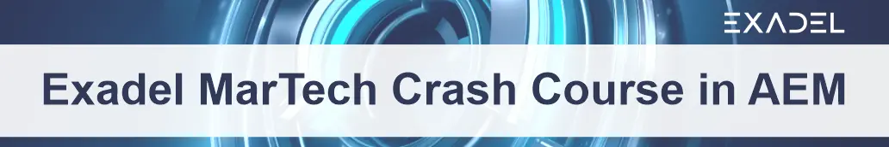

### Lessons
- 2.5 [AEM Components - Part 1](lessons/2.5/part1.md)
- 2.7 [Back-end of an AEM Component. Sling Models](lessons/2.7/part1.md)
- 2.8 [Components View. Markup language HTL (Sightly)](lessons/2.8/part1.md)
- 2.10 [Templates in AEM](lessons/2.10/part1.md)
- 2.11 [AEM server as an application container. OSGi bundles and services](lessons/2.11/part1.md)
- 2.12 [OSGi services configuring and use-cases](lessons/2.12/part1.md)

### Sample project
See source code [here](project)
