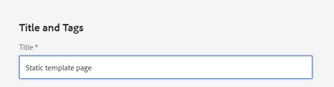
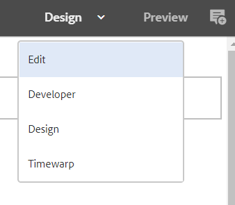
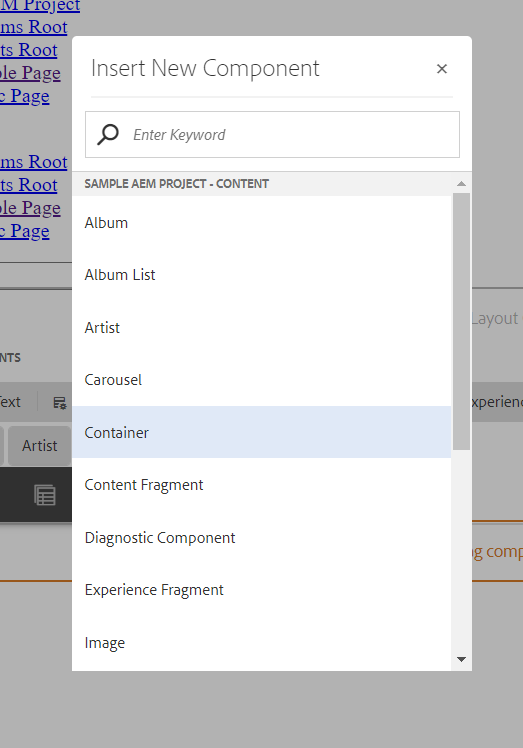
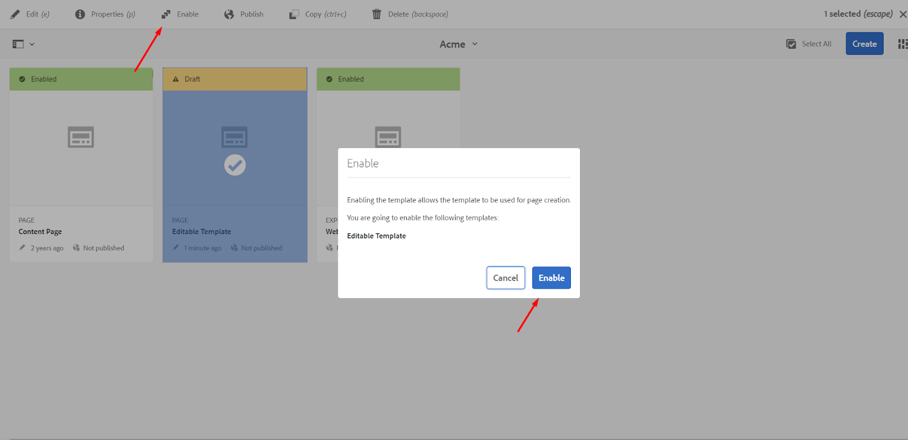
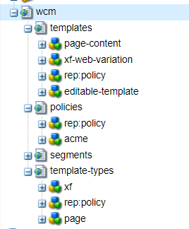
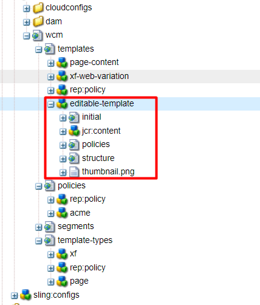

### Static templates

As stated before, static templates are the original templating system that existed before editable templates. Currently, they are not deprecated, but Adobe strongly recommends using editable templates instead. Older projects may still have static templates, so you may encounter them in production.

Let us create a static template based on the page component we created in the first part of our lesson.

#### Creating a static template

1. Go to CRXDE, open `/apps/sample-project`
2. Right-click on the ‘sample-project’ folder, choose “Create” -> “Create Folder”. Enter folder title - ‘templates’
3. Right-click on the ‘templates’ folder, choose “Create” -> “Create Template”. Enter the following properties:  
   Label: staticPageTemplate  
   Title: Static Page Template   
   Resource Type: /apps/sample-project/components/simplePageComponent  
      
   “Resource type” property specifies the resource type of all pages that will be created using this template.
4. Click “Next” until the last screen, then click “OK”. Save the changes
   

Now we are almost ready to start creating new pages from this template. The last thing is allowing this template for our site. There are multiple ways you can allow or disallow the creation of pages from a template under a specific directory. You can learn more about these methods [here](https://experienceleague.adobe.com/docs/experience-manager-65/developing/platform/templates/templates.html?lang=en#template-availability), but for now, let’s allow our template in the simplest way.

#### Allowing a template for a site

1. Open site root page properties http://localhost:4502/mnt/overlay/wcm/core/content/sites/properties.html?item=%2Fcontent%2Fsample-project
2. Go to the “Advanced” tab, add `/apps/sample-project/templates/staticPageTemplate` to the list of allowed templates  
     
   Save the changes.

Now we are ready to create new pages with our component.

#### Creating a page from a static template

1. Go to the sites console: http://localhost:4502/sites.html/content/sample-project/us/en
2. Click “Create” -> “Page”  
   
3. Select “Static Page Template” from the list of available templates, click “Next”
4. Enter page title:  
     
   Click “Create”. Open the created page.

Now we have a page similar to the Simple Page that we have created in the “Extending the page component from an OOTB page component” section. The main difference is, now we were able to do it via the Sites console and avoid creating all nodes manually. This is not the only advantage of using templates. ‘jcr:content’ node of a template can also contain pre-defined components that will appear on all pages created from this template.

We cannot add any components to your newly created page, and now it’s time to fix that. In order to allow components to be added to the template, we should update page designs. Let us go to design mode and add the required components.

#### Allowing components for a page via design mode

1. Choose “Design” mode in the top right corner  
   
2. Click near the “Drag components here” area, then click on the “Wrench” icon  
   
3. You will see the design dialog for the layout container, where you can specify the allowed components, add styles, etc. For now, we will allow the components from our test project and save the changes  
   
4. Return to edit mode:  
     
   Now you can see the “Add” icon on the layout container and add any number of components to your page
   
   

To sum up, in order to set up a static page template, a developer should:

1. Create a page component either from scratch or by extending an existing one.
2. Create a new template and specify the page component in sling:resourceType property.
3. Allow the template to be used under the pages folder - if it is not allowed yet
4. Set up the allowed components in design mode

### Editable templates

Now that we created our own static template, let’s create a similar editable template and see the differences. We will first create the template via the UI and then go to CRXDE to see, what is the node structure of editable templates.

#### Creating an editable template

1. Open templates console: http://localhost:4502/libs/wcm/core/content/sites/templates.html/conf
2. Double-click on the “sample-project” folder, then click on the “Create” button in the top right corner.
3. We are offered to pick a template type - this is a “template’s template” - the basic template structure that is usually created by developers.  
   
   Choose the “Page” template type and click “Next”
4. On the second screen enter the template title and click “Create”. Open the template for editing  
   

You will see something similar to this (the actual template content may be different depending on the archetype version).  

We are now editing the template structure. <ins>Template structure</ins> defines page layout and components that must be present on the page and cannot be changed (e.g. header, footer, layout columns). Changing page structure affects all pages that use this template.

#### Editing template structure

1. If your template does not contain a container yet, add one by double-clicking on the “Drag components here” and selecting the ”Container” option.  
   
2. Unlock the container component for editing so that we are able to add new components into it later.  
   
3. Allowing the components is also done in the structure editor. While static templates had the design mode for this, editable templates have policies. Policies are the rules that are applied to the different parts of the page. These rules regulate allowed components, styles, etc.  
   Click on the “Policy” option in the toolbar to open the policy configuration dialog.
   
4. Our template already has a set-up policy, but you can change it: add/remove components, styles, etc.  
     
   Add the allowed components (if needed) and save the policy.

Now that we’ve set up the structure of the page, we can add some initial content. <ins>Initial content</ins> defines the content that is present on page creation but can be changed by authors. Changing initial content affects only new pages, the existing pages are not affected.

#### Editing template initial content

1. Click on the dropdown in the top right corner and choose “Initial content” mode  
   
2. Now we are in the initial content editor. We can add new components here, and these components will appear on new pages, created from this template. The authors will be able to edit or remove them from the page later.  
   Let’s add a component to the page container  
   

All templates are created as drafts, once they are ready to be used, we need to enable them.

#### Enabling a template

1. Go back to the template editor http://localhost:4502/libs/wcm/core/content/sites/templates.html/conf/sample-project/settings/wcm/templates and select your new template.  
   
2. Enable the template
   
3. If you have a local publish instance, you may also need to publish the template.

Now you can create a page from this template by repeating the steps from “Creating a page from a static template”, and choosing the editable template instead of the static one. If you need to change your template, you can click on the “Edit template” button from the page menu:

And now let’s see what the templates look like in CRXDE

#### Examining template node structure

1. Go to CRXDE, open `/conf/sample-project/settings/wcm` folder  
   
2. We are interested in 3 folders here:
    - templates - contains all templates created for this project
    - policies - contains policies for all templates
    - template-types - templates from which new templates can be created
3. Each template has 3 nodes:  
   
    - structure - represents the templates structure
    - initial - contains initial content of the template
    - policies - links the parts of the page to their policies (which are listed in the parent “policies” node)

You can open these nodes and investigate their contents to understand, how they correspond to the template UI.

One final note on template management. Editable templates were created to enable authors to create and edit templates with little to no help from developers. But in reality, many teams still prefer to make template creation a development task and keep the templates and policies in the codebase. If your team chooses to do the same, you will most likely work with templates by editing XML files rather than working via UI. Also, with this approach, you don’t need to create template types. They are not required for the template and are used only for creating templates from the UI.

---

## Useful links:

1. AEM Templates - general overview + template availability: https://experienceleague.adobe.com/docs/experience-manager-65/developing/platform/templates/templates.html?lang=en
2. Static templates: https://experienceleague.adobe.com/docs/experience-manager-65/developing/platform/templates/page-templates-static.html?lang=en
3. Editable templates: https://experienceleague.adobe.com/docs/experience-manager-65/developing/platform/templates/page-templates-editable.html?lang=en
4. Customizing Page Properties: https://experienceleague.adobe.com/docs/experience-manager-learn/sites/developing/page-properties-technical-video-develop.html?lang=en

---

[To previous part](part1.md)

[To Contents](../../README.md)
