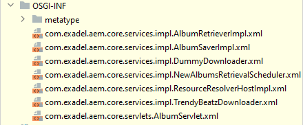

## OSGi services

The OSGi standard describes some entities. The most basic is **OSGi Component**. An OSGi component is a part of the project that:

- Can be started and stopped;
- Can publish or unpublish itself (effectively allowing or disallowing sibling components to interact with itself);
- Can engage sibling components in interaction.

Sounds vague, isn't it? Moreover, we can easily get confused by the very "component" term. Barely have we learned in-page AEM Components, and here we go with some other sorts of components!.. 

Indeed, these ones are completely different creatures.

That is why among AEM developers, OSGi components are rarely named this way. We use the word **Service** instead. However not as standardized, this term will go.

## Understanding Service. Service life cycle

In AEM, a Service is a reusable instantiated Java class that comprises some particular functionality.

* Service is not just a utility class. We have instances of Services, and they usually have non-static methods. Accordingly, they possess states (have local fields).
* A service is reusable. That means, we do not create a new instance every time we require the functionality of a service. Most of the time, a service is a complete singleton. In some other cases, services have several instances. But - again - these instances are highly reused: there are far less instances than the number of cases of their usage.
* Service is automatically instantiated when appropriate. You don't need to call a constructor - the framework does it for you. What is even more important, it picks a proper moment for that.
* A service registers itself in the _Service Registry_ and is accessible via its interface.
* Services refer to each other via respective interfaces. If you know a bit about _Spring_, it will be enough to say that services are _autowired_ (however this operation is named differently here).

```mermaid
flowchart TD
    subgraph sub3[ ]
        subgraph Service3
          r1[Reference to Service1]
        end

        i3[Interface3]-->Service3
    end
    subgraph sub2[ ]
        subgraph Service2
          r10[Reference to Service1]
          r3[Reference to Service3]
        end
        i2[Interface 2]-->Service2
    end
    subgraph sub1[ ]
        subgraph Service1
        end
        i1[Interface 1]-->Service1
        i1-->Service4
    end
    Service1.->r1
    Service1.->r10
    Service3.->r3
```

<details>
<summary><em style="color:#aaa; font-weight: bold">Why you need a service, and when you need it? (click to expand)</em></summary>

Many a time, a developer faces the question, do I have to create a Service here? Or I'll be fine with a "plain" utility class? Or else should I encapsulate this logic in a Sling Model or POJO?

First, models/POJOs are designed to be just data containers. Some logic is possible there if it concerns converting or re-formatting a particular piece of data. Models are poorly designed if there are noticeable, dozens-lines-long computations going on inside (or new objects are created or stored). Such logic should be moved away from a model.

Second, for implementing service-like logic, you usually choose between a utility (helper) class and exactly a service. A service wins if there's a need to persist a state (a piece of data, a variable) between calls and/or share it between threads. Note that every HTTP request spans a new thread, and if there's some data to keep between requests, service is your choice.

Third, you would definitely want a service class if you you need to refer to another service. The framework will do the "auto-wiring" job for you. Other possible ways to retrieve a reference to another service can be cryptic and error-prone.

Fourth, services are polymorphic in nature. A service is almost always referenced via its interface. There can be several implementations of the interface. The framework is responsible for picking up the most suitable one. Besides, you can instruct the framework on what implementations to use in what circumstances.

This gives you vast possibilities for altering the way the code is executed (e.g., one logic for production use and a slightly different one for unit tests). You can also provide connection points for other developers to extend or modify your code. They can promote another implementation for a service of yours as it fits their needs. Besides, you can override the out-of-the-box services and thus change how AEM itself behaves.

Fifth, services can be set up in such a way that an instance is created no sooner than it is actually needed elsewhere in the code. This is useful if the initialization is time- and CPU-consuming (e.g., the service needs to first read some data from the network or load a file). Think of a Windows application that uses the "delayed autostart" option. On the contrary, you cannot control the timing of the initialization of a static variable in a utility class. It usually happens right after the class is loaded in memory.

However, there are such kinds of logic that a good old utility class would win as the best solution. You may have a bunch of methods that are implemented in the functional style (process their arguments and return a value without side effects). May it be these methods refer to none of the other services. You are not going to provide alternations of these methods, nor do you plan a specific rendition for tests. In this case, there's no need to wrap them in OSGi service.
</details>

#### Class composition of a service

As we said, a typical service consists of two parts:

* A Java interface containing at least one method;
* And a public Java class annotated with `@Component` (yep - that "other sort" of a component we talked about).

```java
public interface ModelProcessor {
    void process(SomeModel value);
}

// ...

@Component(service = ModelProcessor.class)
public class ModelProcessorImpl implements ModelProcessor {
    @Override
    public void process(SomeModel value) {
        // implementation code        
    }
}
```

The `@Component`-s `service` property is optional. It reiterates what interface the current class implements.

Interestingly, the interface must not necessarily be a custom one. A core interface (such as `Runnable`, `Callable`, or even a functional interface, e.g., `Function<Boo, Bar>`) would do.

<small>Moreover, with `service = ...` you can even declare _the current class_ as an "interface" for itself! This is a bit of a hacky solution. But it will work if you cannot declare a separate interface and/or absolutely don't want another implementation to be introduced by someone else.</small>

By an old gold tradition, the implementations of services are named `...Impl` and are usually placed in a subpackage by the name of `impl`. (This tradition is not strictly obeyed, though).

```
com
└ exadel
  └ aem
    └ services
      ├ impl
      │ └ MyServiceImpl.java
      └ MyService.java
```

#### Life cycle methods

A service class can have arbitrary number of methods. Some of them can be mapped to the three service's life cycle stages. The mapping is done by the special annotations: `@Activate`, `@Deactivate`, and `@Modified`.

```java

@Component(service = Runnable.class, immediate = true)
public class MyServiceImpl implements Runnable {
    private static final Logger LOG = LoggerFactory.createLogger(MyServiceImpl.class);

    @Override
    public void run() {
        // implementation code        
    }

    @Activate
    private void doActivate() { // The name of the method can be any
        LOG.info("This method implements when the service first started. Happens at least once upon the start of the containing bundle");
    }

    @Deactivate
    private void doDeactivate() { // The name of the method can be any
        LOG.info("This method implements when the service is shut down. Happens at least once when the containing bundle is stopped");
    }

    @Modified
    private void doModified() { // The name of the method can be any
        LOG.info("Implements usually at the time that the configuration of the service changed (e.g. when a user made changes to the /system/console/configMgr console");
    }
}
```

None of the _activate_, _deactivate_, or _modified_ methods are necessary if there's no specific logic to be implemented at a life cycle stage.

The same method can be attached more than one life cycle annotation. E.g., a fairly common case is making one method be responsible for both _activate_ and _modified_:

```
@Activate
@Modified
private void consumeSettings(Map<String, Object> settings) 
   // implementation code        
}
```

This combination is not occasional. Both _activate_ and _modified_ routines are often used for the same goal: to read the user settings for the current service. The settings can moreover be passed directly as the method's argument. (It rather means that if you create such a method and add an argument like `Map<String,Object> settings`, the framework will be clever enough to understand that you want the settings passed here.)

Apart from `Map<String,Object>` of settings, the _activate_ or _modified_ method (or else the combination of both) can consume arguments of types:

* `BundleContext` - context for the bundle that holds the component that is being activated. See spec [here](https://docs.osgi.org/javadoc/r4v43/core/org/osgi/framework/BundleContext.html);
* `ComponentContext` - context for the current service. Read more [here](https://developer.adobe.com/experience-manager/reference-materials/6-4/javadoc/org/osgi/service/component/ComponentContext.html);
* or an object representing the service config (see more [in the next lesson](part3.md)).

You can even declare all multiple parameters like

```
@Activate
@Modified
private void onServiceUpdate(
    BundleContext bundleContext,
    Map<String, Object> properties,
    ComponentContext componentContext,
    MyOwnServiceConfig config) {
     // ... 
    }
```

The order does not matter.

There are advanced tips and tricks regarding usage og OSGi services life cycle stages. Look for them
is [this article](https://liferay.dev/blogs/-/blogs/revisiting-osgi-ds-annotations#:~:text=not%20be%20invoked.-,%40Activate,Spring's%20afterPropertiesSet()%20InitializingBean%20interface)
or elsewhere on the Internet.

#### Control the timing of the service's start

Look at the `@Component`-s `immediate` property. It states that the instance of service will be created as soon as the OSGi framework takes control of the current bundle. As we said above, this is not necessary. Skip `immediate = true`, and the service will be instantiated, literally, after the first attempt to call it elsewhere in the code. 

<u>Important</u>: if you created a bunch of services that have references to each other, at least one should be `immediate = true`, or else they will just be "sitting there waiting for each other", and none will start.

#### Properties of a service

The OSGi standard envisages that a service has an arbitrary set of additional properties specified via the dedicated
annotation key:

```
@Component(
        property = {
                "some.property=foo",
                "another.property=bar",
                "int.value:Integer=42",
                "bool.value:Boolean=true"
                // etc.
        }
)
```

(Beware: there are two keys within `@Component`: `property` and `properties`. Confusing as it is, we work with the first one.)

Every such property is a string containing a key and a value separated by the equality sign. There are plenty of predefined property names, e.g. `service.ranking` or `service.pid`. You can create custom ones. Later we'll see how you can use them.

<details>
<summary><em style="color:#aaa; font-weight: bold">You may wonder how all these annotations and properties affect the OSGi framework (click to expand)</em></summary>

Same as with `MANIFEST.MF`, annotations are there just to produce some metadata. When the bundle is deployed to an AEM server, they do not matter anymore. Instead, the framework considers metadata files that were created while building the project (they were created along with `MANIFEST.MF`). For every service, there is an XML file within the `OSGI-INF` folder.



A single definition might look like the following (a live snippet from the sample project):

```xml
<?xml version="1.0" encoding="UTF-8"?>
<scr:component xmlns:scr="http://www.osgi.org/xmlns/scr/v1.3.0"
               name="com.exadel.aem.core.services.impl.AlbumRetrieverImpl"
               activate="doActivate"
               deactivate="onDeactivate">
    <service>
        <provide interface="com.exadel.aem.core.services.AlbumRetriever"/>
    </service>
    <reference name="albumSaver"
               interface="com.exadel.aem.core.services.AlbumSaver"
               field="albumSaver"/>
    <reference name="downloaders"
               cardinality="0..n"
               interface="java.util.function.Supplier"
               field="downloaders"
               field-collection-type="service"/>
    <implementation class="com.exadel.aem.core.services.impl.AlbumRetrieverImpl"/>
</scr:component>
```

Same as with the `MANIFEST.MF` file, you might one day have the need to add a missing service definition manually. 

<small>It may happen, in particular, when creating unit tests for a service. If you wish to run tests one by one (via, e.g., the IntelliJ IDEA interface and not with a Maven command), you might face the situation that the service descriptions for test services are not created or are obsolete. It is the Maven plugin that creates the definitions, and the plugin has not been run. Instead, you can copy an XML file(-s) from the `target` folder of the "original" module and paste into the manually created `OSGI-INF` folder under the test resources root. </small>
</details>

### How services commute. Referencing a service

#### Referencing a singular service

You can refer to another service from the current service by declaring a field like

```java

@Component
public class MyServiceImpl implements MyService {
    @Reference
    private AnotherService anotherService; // Always prefer an interface as the type of field, not an implementation!
}
```

This is the most basic case. The OSGi framework will look through the service registry, find the appropriate service implementation, create an instance of it (if not yet instantiated), and inject it into the field. If anything in this chain of action fails, the field will remain `null`.

<details>
<summary><em style="color:#aaa; font-weight: bold">What will the framework do if there are more than one implementation (click to expand)</em></summary>

<b>Case 1: Selecting an implementation unfiltered</b>

The framework picks the most appropriate service implementation by the `ranking`. Ranking can be specified in the `@Component` annotation like the following:

```java

@Component(
        property = {
                "service.ranking:Integer=1000"
        }
)
public class MyServiceImpl implements MyService {
    // ...
}
```

Of the contenders, the service with the greatest ranking number is elected. If there are two or more services with equal rankings (including those with the default non-specified ranking), the one with the lowest _PID_ is selected. Lower _PID_-s are usual for the out-of-the-box services that initialize earlier. Thus, the standard implementations prevail unless you impose an "overriding" one that would have a non-default ranking set by you.

<b>Case 2: Selecting an implementation based on a filter</b>

Sometimes you know the parameters the referenced service implementation must match. The good practice is to state such parameter as a service's property. Consider the following example:

```java
public interface ProducerService {
    String getText();
}

// ...

@Component(property = "param=Foo")
public class Producer1 implements ProducerService {
    @Override
    public String getText() {
        return "The text is Foo";
    }
}

// ...

@Component(property = "param=Bar")
public class Producer2 implements ProducerService {
    @Override
    public String getText() {
        return "The text is Bar";
    }
}

// ...

@Component
public class Consumer implements ConsumerService {

    @Reference(target = "(param=Foo)")
    private ProducerService producer;

    @Activate
    private void doActivate() {
        System.out.println(producer.getText());
        // Types "The text is Foo"
    }
}
```

You can provide the `target` parameter to `@Reference` in which you specify a query in the format known as "LDAP search filter". Basically, this is nothing more than an equality statement that cites the key and the desired value. apart from strings, you can play around with statements comparing numeric and boolean values.

The "terminal" case of such statement is the one that requires the precise name of implementation class:
```
@Reference(target = "component.name=com.exadel.aem.core.services.impl.AlbumRetrieverImpl")
```

You see, it somehow breaks the very idea of referencing interfaces rather than classes, but is still used in some real-world scenarios.
</details>

#### Referencing a collection of services

Sometimes you may want to link all the available implementations at once. A use case: the implementations are kind of "suppliers" of some data, and you want to retrieve data from all the suppliers.

In this situation, you inject not a single object but a collection of objects and provide the `cardinality` value. Additionally, you may need to specify the _GREEDY_ policy option which means that you expect the current service to "grab and gold" as many matching references as possible. 
```
@Reference(cardinality = ReferenceCardinality.MULTIPLE, policyOption = ReferencePolicyOption.GREEDY)
private List<MyService> myServices;
```

> Find out the use of such an approach in the sample project's [AlbumRetrieverImpl](../../project/core/src/main/java/com/exadel/aem/core/services/impl/AlbumRetrieverImpl.java).

<details>
<summary><em style="color:#aaa; font-weight: bold">New references can be added event after the current service is started (click to expand)</em></summary>

Injecting a collection of services has an interesting nuance. Implementations of the current service interface may reside in different bundles. And the bundles, as you know, can be installed and uninstalled independently of each other at any time. Therefore, we can face a situation when the current service has been working for a while already, and a new implementation of `MyService` has just arrived. Will it be added to the `myServices` list?

Depends on the two properties you can specify for the `@Reference` annotation: `referencePolicy`
and `referencePolicyOption`.

Default `referencePolicy` is _STATIC_ while default `referencePolicyOption` is _RELUCTANT_. It means a new implementation that became available won't be automatically bound. But if the values are respectively _DYNAMIC_ and _GREEDY_, the list of references will be supplemented as soon as a new service implementation becomes available. The same principle applies to the situation when a bundle containing a reference unloads.

Above all, setting `referencePolicy` to _DYNAMIC_ allows event-driven reference management because the _bind_ and _unbind_ methods are honored. See the next chapter for detail.
</details> 

#### Event-driven references. Binding and unbinding

The OSGi framework supports calling a particular method of a service when a reference arrives or departs. The name of the "on arrival" method can be specified in the `bind` property. The `unbind` property specifies the name of the method that is called when a reference is being removed.

How can one use these methods? For example, you can store the collection of references in a map rather than a list.

Consider the example:
```java
import java.util.HashMap;
import java.util.stream.Collectors;

@Component
public class DownloadManagerImpl implements DownloadManager {

    @Reference(
            service = Downloader.class,
            cardinality = ReferenceCardinality.MULTIPLE,
            referrencePolicy = ReferencePolicy.DYNAMIC,
            bind = "onReferenceArrived",
            unbind = "onReferenceGone")
    private Map<Downloader, Integer> downloaders = new HashMap<>();

    @Override
    public void runDownloaders() {
        List<Downloader> downloadersSortedByRanking = downloaders
                .values()
                .stream()
                .sorted(Comparator.reverseOrder())
                .flatMap(ranking -> map.entrySet()
                        .stream()
                        .filter(entry -> ranking.equals(entry.getValue())))
                .map(Map.Entry::getKey)
                .collect(Collectors.toList());
        downloadersSortedByRanking.forEach(Downloader::download);
    }

    private void onReferenceArrived(
            Downloader value,
            Map<String, Object> properties) {

        int ranking = Integer.parseInt(properties.getOrDefault("service.ranking", "0"));
        downloaders.put(value, ranking);
    }

    private void onReferenceGone(Downloader value) {
        downloaders.remove(value);
    }
}

// ...

public interface Downloader {
    void download();
}
```

In this code we want to call the `download()` method on every downloader (= service instance implementing the `Downloader` interface). We also wish that the downloaders were processed in the particular order: from one with the highest ranking to one with the lowest.

For this sake, we do not plainly inject `Downloader` instances. Instead, we save them into a map. Since the reference policy is _DYNAMIC_ and referenced services may come and go as sibling bundles install or uninstall, we don't know the exact set of downloaders before we actually call the `runDownloaders()` method. Within this method, we first sort the downloaders by their ranking, descending order, and only then call the method on each of them.  

#### Referencing a service in Sling Models and HTL

There isn't new information here, just a recap. In a Sling Model we retrieve an instance of a service with `OSGiService`:
```java
@Model(adaptables = SlingHttpServletRequest.class)
public class MyModel {
    
    @OSGiService
    private ModelFactory modelFactory;
}
```

We can pick up the desired implementation with the `filter` property (the direct analog of `@Reference(target = "...")`). But there isn't any analog of `cardinality`, nor policy options or binding methods. All in all, it just reminds us that Sling Models are not designed for complex logic.

Another way is to retrieve a reference to a service with `SlingScriptHelper`. This way we can even retrieve an array of instances, although indirectly:
```java
@Model(adaptables = SlingHttpServletRequest.class)
public class MyModel {
    
    @SlingObject
    private SlingScriptHelper slingScriptHelper;
    
    private MyService myService;
    
    private MyOtherService[] myOtherServices;
    
    @PostConstruct
    private void init() {
        myService = slingScriptHelper.getService(MyService.class);
        myOtherServices = slingScriptHelper.getServices(MyOtherService.class,"(foo=bar)"); // a LDAP search filter can be passed as the second argument
    }
}
```

Interestingly, a service can be injected directly into the HTL markup
```html
<p data-sly-use.search="com.exadel.aem.services.SearchServiceImpl">
   ${search.results}
</p>
```
Just remember that an HTL script in normal situations can only call zero-argument methods, so your service must provide one.

---

[Continue reading](part3.md)

[To Contents](../../README.md)