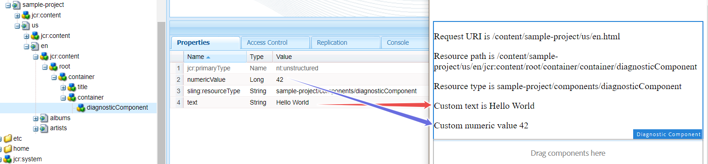
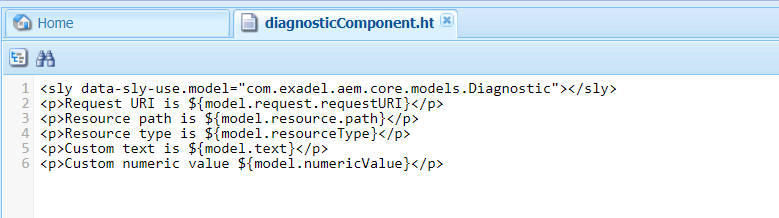
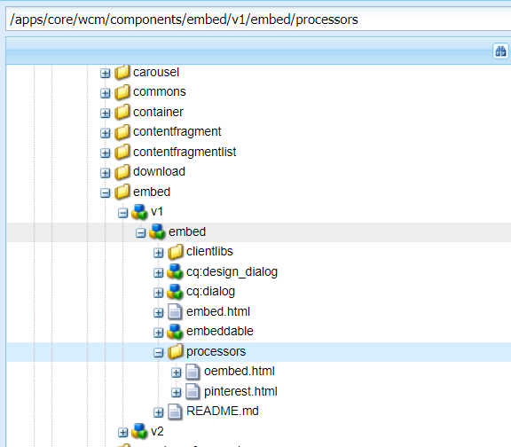
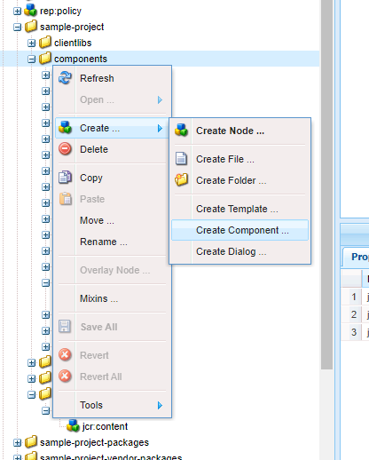
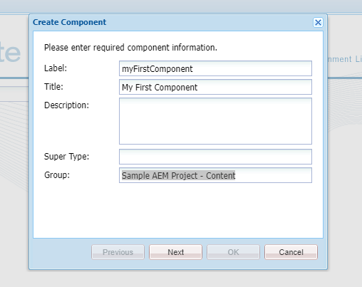
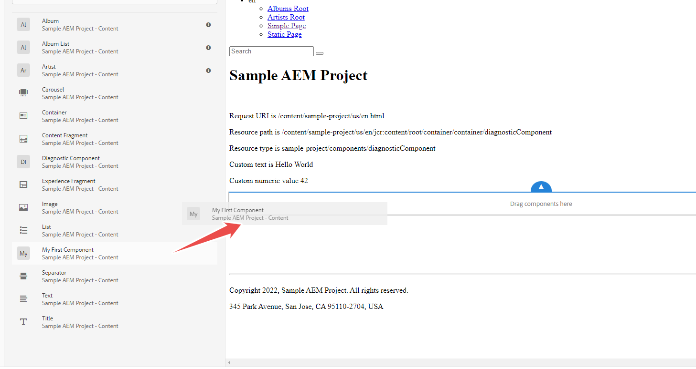
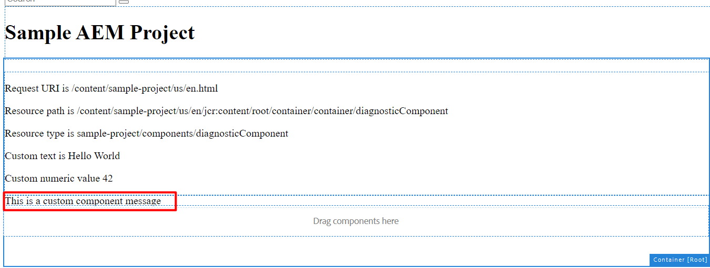
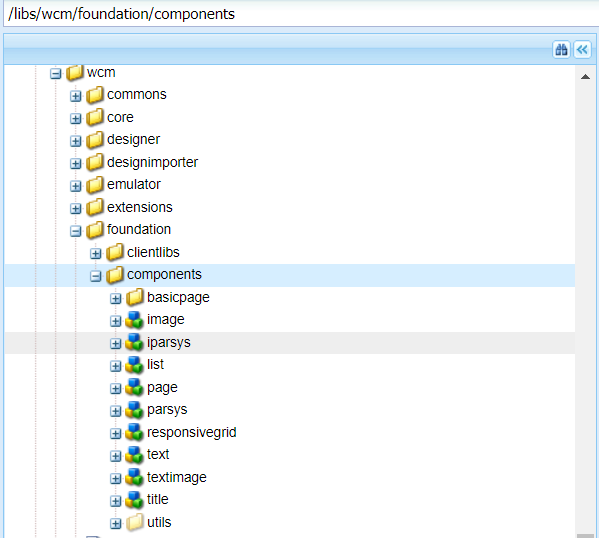

# AEM Components - Part 1

## AEM Components - building blocks for a website

If we take a look at a website page, we can visually split it into blocks. An average web page has a header, a footer, the main section (which can sometimes be split into columns). Each of these blocks can be further divided into smaller blocks, e.g. an image block, a text block or a button.


The truth is, almost every page can be created using the same blocks in different combinations. Sometimes you only need a small design change.

In AEM these reusable blocks are called components.
AEM Component is a part of a page that is formed independently of other page parts and displays certain data. A component can only be moved, copied or pasted as one entity. A component is like a Lego brick - you can’t split a brick, but you can combine the same bricks to build different things. The more “universal” the bricks are, the better.

## AEM Component structure

Components on the page are the composition of content and the code that can handle and display this content. There is no component without some code and some data. The data is usually stored in JCR under the _/content_ directory. You have already seen how pages are stored in JCR. Under each page, there is a bunch of nodes that have the data. This data is displayed via the bound components (usually every node corresponds with a component of its own). The nodes' order matches the order of the components on the page. Each node has properties and subnodes that define the component display: text, image URLs, background colour, font size, etc.


Again, mind that a node under the page within the _/content_ folder only corresponds to a component. It is not the component itself! It just indicates the place where the component will be rendered and contains the data for the rendering. The component itself is a different node, that is located under one of the 2 directories: _/apps_ or _/libs_

This explanation may sound strange, and you may ask yourself, why do we need two different nodes located in different directories to display one component?

Things will start to make sense once you think about how a computer works with its files. On your computer, you have files (e.g. text files, Excel spreadsheets, etc.) and programs that can display these files (notepad.exe or excel.exe). But the programs are also files! These two types of files (the document file and the .exe file) do not make sense without each other. You are not able to work on a .xlsx file without a program for editing spreadsheets, but there is no point in opening Microsoft Excel unless you have a .xlsx or want to create a new one. Moreover, one such program can work with lots of document files.

Components in AEM work by the same principles. The component node under _/apps_ or _/libs_ is similar to a program executable. A node under the page is similar to a document file. A component node (= a program) uses it to render a part of the page. Usually, there are dozens or even hundreds of content nodes that are located on different pages. And there is a much more limited set of component nodes that renders all these chunks of content.


How does AEM know what component should render a particular content node? How are component and content nodes linked? If we go back to the files example, operating systems have a registry, where all file types are linked to programs. AEM also has links between content nodes and components: each content node has a `sling:resourceType` parameter that refers to the rendering component.

Let’s take a look at our test page http://localhost:4502/editor.html/content/sample-project/us/en.html. You already know, that each page has a corresponding node. We can find it in CRXDE


If we expand the nodes tree, we will eventually find the node that is responsible for the “Hello World” text on the page. We can see these words in the “text” property. We can change them here, and, after saving the changes the result will appear on the page.



But how exactly do these words appear on the page? They are rendered by a component. Which one? The one, that is specified in the `sling:resourceType` property of the content node. A resource type is just a path to the component node, with the first level folder usually omitted. Most of the time we assume that components are stored in the _/apps_ folder, so we can open the node under this path and take a look at the component itself.
The component node always has the `cq:Component` primary type. It also has a component’s title in the `jcr:title` property and can have a component group. You can see the component’s title and group when you add the component to the page.


Under the component node, you will most likely see a .html file (or, less likely, a .jsp file).

<details>
You can occasionally encounter components that do not have a .html or a .jsp file. These components are inherited from other components and reuse their markup.
</details>

This .html file is responsible for rendering the content. Let’s open the file and take a look at the markup. It mostly looks like regular HTML markup.



If the component consisted only of HTML markup, it would render the same content on each page. But most components are dynamic and render different data depending on the underlying content node, HTTP request parameters, etc. The dynamic part of the component is provided by the HTL scripting language. The idea will look familiar to you if you have ever worked with PHP or Node.js template engines. If not, we have a separate lesson dedicated to HTL [here](../2.8/part1.md).

In short, HTL is responsible for adding content data into HTML, conditional rendering or rendering markup in a loop (e.g. when you have a collection of Strings and want to display all of them in a list).

There can be several .html files in one component, they can even be organized in subfolders. This is because some components can be complex, and we may need to reuse the markup across the codebase.



<details>
In HTL files, you may sometimes see data-sly-use directives, which look like this:

```html
<sly data-sly-use.album="com.exadel.aem.core.models.Album"></sly>
<sly data-sly-use.mapUtil="helpers/map.js"/>
```

 These “imported” classes and scripts can be viewed as parts of the component, but they can also be used independently, in servlets, services, etc. Some people tend no name these classes/scripts components. But this is not true. A component is exactly the node with `cq:Component` primary type and all the markup files under this node that may or may not use Java classes or scripts.
</details>

Under the component node, you may also see such subnodes as `cq:dialog`, `cq:editConfig` or `cq:design_dialog`. Generally speaking, they provide editing capabilities for the component. We will talk about them in detail in the second part of this lesson.

## Creating our first component

Let’s create our first component. We will do it in CRXDE, as a training exercise, but you should bear in mind that on real projects new components are created in the codebase and then deployed via a package. Moreover, you should never do any huge changes in CRXDE - they will be overwritten with the nearest deployment.

#### Creating a component

1. In CRXDE, find _/apps/sample-project_ (you can use our sample project or create your own - the important thing is that there should be at least one folder between the _/apps_ and the folder of your component).
2. Under _/apps/sample-project_ create a folder with the name “components” (if it does not exist yet).    
   
3. Right-click the “components” folder and select the “Create Component” option. Fill out the title and group. We should also specify the “Label” property - this is the name of the component node.  
   
4. Click “Next”, then - “OK”. Save the changes.
   You may wonder, what is the purpose of the component group. It is mainly used in two ways: to group similar components and to allow adding all components of a group inside a container. Component groups are similar to user groups in operating systems and networking.
   The group name is arbitrary, but there is one commonly used name - `.hidden`. The components from this group are added programmatically or embedded. They are hidden from the authors and cannot be added manually.  
5. CRXDE has created a `myFirstComponent.jsp` file, but we want to use HTML markup. Rename `myFirstComponent.jsp` to `myFirstComponent.html`. Mind that the file name should be the same as the name of the component node. In lesson 2.9 you will learn the rules of sling resource resolution and why sometimes files should be named in a certain way.
6. Our first component’s markup will be very simple - it will just contain “Hello world”. Open the HTML file for editing and change its contents. Don’t forget to save the changes!  
   
7. For the component to be properly recognized by AEM, it should contain either a `cq:dialog` or `cq:editConfig` subnode. for now, we can either copy such node from another component, or create it ourselves  
   
8. Congratulations, we have created our first component! Now, let’s add it to the page. Open http://localhost:4502/editor.html/content/sample-project/us/en.html and drag the component from the left rail.
   

Note that not every component is allowed on every page. There is always an allowed list. Depending on the project setup you may need to allow your new components manually, one by one or via a group.

We did not need to explicitly allow our component for the page. We just added it to a pre-defined group called "Sample AEM Project - Content", that has been allowed to be used on the training project’s pages.

Now we see the component on the page, but it looks very static. Most components are created to display dynamic data. Let’s make our component render arbitrary text.

#### Adding dynamic data to the component markup

1. In CRXDE open _/content/sample-project/us/en_ and find the component node
   
2. Add a new property:   
text: This is a custom component message.  
Save the changes
   
3. Go to _/apps/sample-project/components/myFirstComponent/myFirstComponent.html_, change the markup from “Hello World” to ${properties.text}. Save the changes
   
4. Refresh the page to see what’s changed
   

The component has taken the text value that we had manually put into JCR. We did it with CRXDE. But the true authors usually do not use CRXDE for editing components. They change them on the page, via authoring dialogs. We will cover authoring dialogs in detail in the next lesson.

Let’s reiterate one very important concept. We were adding data into the component node under _/content_. This is where the component takes its data from. But the component itself, as you remember, is located under _/apps_.
The link between the content node and the component itself is the `sling:resourceType` of the content node. The node’s name is unimportant, only the path to the component matters. We can even change the path to the component (resource type) in CRXDE - and the component on the page will also change.

Sometimes the new component uses the same properties as the old one. This is especially true for the properties with common names, e.g. `jcr:title`. We can use it to our benefit (e.g. when we want to migrate an old component to its new version, the new component should preferably use the same property names). But it can also lead to unpredictable consequences. Going back to the filesystem analogy, we can rename image.jpg to image.txt and open it in a text editor. The image will be opened, but the user will not see what they expected.

## Standard components

Developers often create new components that serve different purposes. However, AEM offers a suite of components that can either be used directly or inherited from.

Many standard components can be found under _/libs/wcm/foundation/components_.



The most popular of them is parsys (short for “paragraph system”). This is a typical example of a container component. It does not add much to the page, just allows adding other components into itself.
There are other container components, namely:

- Iparsys (inherited paragraph system) - allows inheriting its contents onto child pages. Useful for such elements as headers and footers.
- Layout container (a.k.a. responsiveGrid) - a new and enhanced version of parsys components made for [editable templates](https://experienceleague.adobe.com/docs/experience-manager-65/developing/platform/templates/page-templates-editable.html?lang=en). Allows configuring responsive layout for different breakpoints and adding custom styles.

Parsys was the first among the containers. That is why many people use the word “parsys” whenever they describe a container, no matter what type.
Container components can be found on almost every page. Moreover, the page itself can be considered a super-container because it usually includes components.

If we speak about OOTB components, we should also mention AEM Core Components. This a new generation of standard components, that are designed to simplify creating standard layouts (buttons, texts, images) and quickly stylising them. They can also be used as a base for inheriting and creating custom components. You can read the detailed documentation here https://www.aemcomponents.dev.

To sum up, today we have learned how components can be used as building blocks for creating new pages. We have seen that components can display static data, as well as dynamic data. In the next lesson, we will cover component authoring - changing the data in JCR via the component itself.

Useful Links:

1. AEM Components: https://experienceleague.adobe.com/docs/experience-manager-65/developing/components/components-basics.html?lang=en
2. Developing AEM Components: https://experienceleague.adobe.com/docs/experience-manager-65/developing/components/developing-components.html?lang=en
3. Core components: https://experienceleague.adobe.com/docs/experience-manager-core-components/using/introduction.html?lang=en

---

[To Contents](../../README.md)