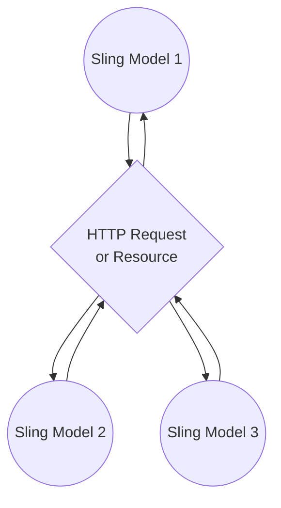
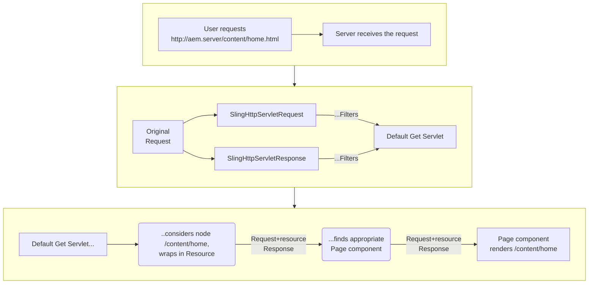
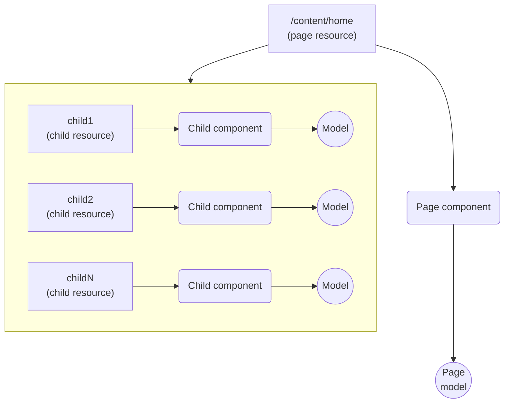
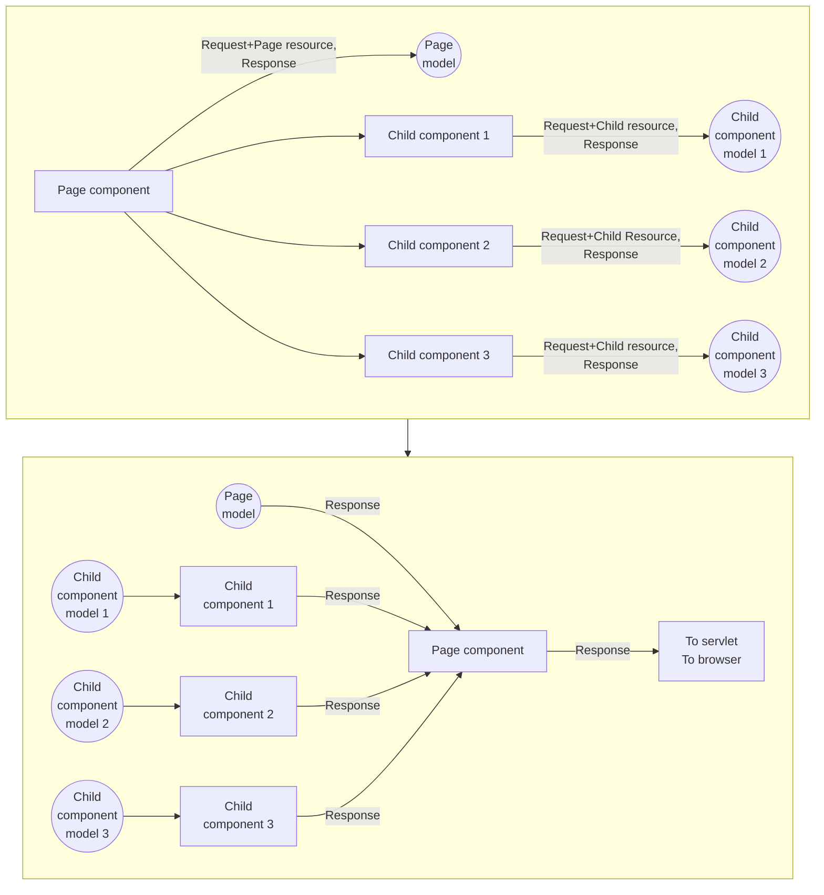

# 2.7 Back-end of an AEM Component. Sling Models

We have just learned what an AEM component is. Let us just remind that it usually consists of these three parts: 
- the Java code that prepares and manages the data to display. Occasionally, this can be not a Java class but a JavaScript object (so-called JS use-object). But eventually it also compiles into a Java class;
- the presentation itself. Nowadays it is usually backed by an HTML file with script insertions. This format is named *HTL*, or else *Sightly*. But sometimes you can see a JSP file instead;
- and the authoring part: the dialog and sometimes the in-place editing, set up via XML.

Today’s story is about the Java part.

## Sling Models Essentials 

### What is a Sling Model?

A Java class behind an AEM component is meant to be just a container of info that the component displays. No tricky logic; just properties and their getters. Such classes are commonly named "Plain old Java objects" – POJOs. Same objects are sometimes called "Data transportation objects" – DTOs. 

In previous AEM versions, component classes used to extend a single abstract superclass by the name of `WcmUsePojo`. You can still meet such in a legacy codebase quite often. But using a `WcmUsePojo` descendant is not quite convenient. Sometimes you really need to derive your class from some other ancestor. Also, with `WcmUsePojo`, you have to write down a bunch of boilerplate code for proper initialization. We added such class in in our sample project for your reference.

Later, Apache Sling came up with a better solution – Sling models. Now it is the most welcomed candidate for an AEM component backend.

A Sling Model is an POJO class or else an interface that bears data. The source of this data is usually:

- an HTTP request, with its attributes, parameters, headers, etc.; 
- or a stored JCR resource (a similarity of a "database entry" in the AEM world) with its properties and, possibly, child resources;
- or both.

A request or a resource can contain any data. There is not a precise structure. On the other hand, a Sling model, being a Java class, is strictly structured. It only contains the fields that it declares (or inherits). 

That is why a model is "less" than the modelled entity. It is a projection – something that reminds of a flat shadow cast by a 3D object on some surface. 


A request or a resource, can be accompanied by multiple models, each possessing a subset of properties. In this respect they say of a model as an *adaptor*. A model adapts a request, a resource, or another entity to some view that has need in a particular subset of data fields. 

Adapting is a keystone of the "philosophy" of Sling. A lot of things are adapted to another lot. Later you will see calls to `adaptTo()` in abundance of places. No accident that the most prominent biannual summit of AEM developers is also named [AdaptTo](https://adapt.to/2021/en.html).

Let us talk about how Sling models are actually produced.

### Models are populated via injection

A Sling model is just a class annotated with `@Model`. Such class contains a bunch of annotated members (fields or methods). Sling creates an instance of a `@Model`-annotated class, then looks at the class members’ annotations and assigns values to appropriate members. It uses reflection for that. Generally speaking, it works much the same as it does in Spring or Hibernate.

The one important restriction, is that the Sling engine must know ahead, where to look for the model classes. In the POM file of a bundle module you must mention one or more Java packages in which models are situated. As you specify one, its sub-packages will also count.
```xml
<plugin>
    <groupId>org.apache.felix</groupId>
    <artifactId>maven-bundle-plugin</artifactId>
    <extensions>true</extensions>
    <configuration>
        <exportScr>true</exportScr>
        <instructions>
            <Import-Package>*;resolution:=optional</Import-Package>
            <!-- See here: -->
            <Sling-Model-Packages>com.exadel.aem.models</Sling-Model-Packages>
        </instructions>
    </configuration>
</plugin>
```
If you forget to specify a package for models, or place you model elsewhere, no error will be thrown, but your model’s fields will stay null which can be confusing. So never forget this.

Another thing to remember is that a model class must be public and have a default no-argument public constructor (= no explicit constructor at all). 

A model class can be nested in another class but still must be public and also static.

A model class can extend any other class, whether it is a model itself or not, and implement any interface. If you are extending another model, be sure to duplicate the `@Model` annotation as it is not "inherited".

### @Model annotation. What it has to do with adaptables
Now let us get th the `@Model` annotation:
```java

@Model(
    adaptables = {SlingHttpServletRequest.class, Resource.class}, 
    defaultInjectionStrategy = DefaultInjectionStrategy.OPTIONAL
)
public class MyModel {
    // ...
}
```
`@Model` must specify its `adaptables` property. It tells about the entities this model represents. 

The usual adaptables for a model are `SlingHttpServletRequest` and `Resource`. Why them? This is determined by the way a request is processed by AEM as an HTTP server.

Below is a look at this process.

<details>
<summary><b>How a Sling model fits in the HTTP request/response flow? (expand to see)</b></summary>

A Sling model is usually a part of an AEM component. A component lives in a page and displays a part of the page’s data. It is initialized when a user requests a page, alongside with other components that are bound to other parts of the same page’s data.

That being said, when a user navigates in browser to e.g. http://aem.server.com/content/home.html, an HTTP request is issued. In the AEM server, the request is being wrapped in an object of type `SlingHttpServletRequest`. Also an object of type `SlingHttpServletResponse` is created. The former contains requisites of the user request: from query parameters to cookies and posted payload if there’s any. The latter is used to write out the server’s output.

This pair of them will go through a series of filters and ultimately lands in some HTTP Servlet. You definitely know this mechanics from the learning of Java HTTP server and Apache Tomcat.

Unless the request is some specific one, the servlet will be the so-called _Default Get Servlet_ designed to serve requests for ordinary pages.

What does the _Default Servlet_ do with the request's URL? It looks for the node at path _/content/home_ in the content storage – the JCR. If there is such, and it has its `sling:resourceType` property, the servlet gives control to the component represented by the `sling:resourceType` value. Virtually. the servlet "asks" the component to render the page.  The component is given the pair of `SlingHttpServletRequest` and `SlingHttpServletResponse` objects that the Default Servlet has received just before.



Inside this request, there’s a reference to the node that has been requested: _/content/home_. The node is decorated with a `Resource` object. The `Resource` is a higher-level abstraction over the node: a sort of "Node Plus".

Of all the facilities that the `Resource` provides, the most notable is `ValueMap` – the collection of the node's properties as a key-value map. Since the resource represents a node, and a node is a part of a node tree and may have descendant branches, there can also be a collection of child resources.

Such component as that was given the floor when processing _/content/home.html_ is a page component. It matches a page resource. A page resource has child resources. Each of them is processed by a component of its own. So the page component in turn asks its child components to render a part of the page. Each of these child components is given the reference to `SlingHttpServletRequest` and `SlingHttpServletResponse`. Each request also encapsulates a resource. This time it will be not the page resource but a child resource inside the page.


Child components with helps of models of their own produce parts of the page. The parts build up to the whole content of the page (the page component itself adds its share). The content written in `SlingHttpServletResponse` is returned to the Servlet. The servlet outputs it back to the user.


</details>

The Sling model we create for a component is the one that lives within the request/response flow. Therefore one can retrieve and inject a request attribute, or a query parameter, or maybe a request header. 

Also, a request encapsulates a resource. So you can inject the properties of the resource (or strictly speaking, of its `ValueMap`). Also you can inject children of the current resource. Adapting from request gives you freedom of choice. That’s why they recommend to adapt models from a `SlingHttpServletRequest.class` whenever possible.

Unfortunately, this is not always possible. Sometimes models are not created under the auspices of _Default Get Servlet_. There can be a scheduled job, or a spin-off routine that reads JCR nodes and retrieves them as resources but has nothing to do with HTTP stuff. Even in your component-bound model you may have such a spin-off task that would retrieve more resources and adapt them to secondary models ignorant of the HTTP request.

In such cases a model has to be adapted from just `Resource.class`. Understandably, there won’t be a possibility to inject anything bound to a request. 

Some models are designed to work in both scopes: when there’s a request and when there’s none. Such can be adapted from both `{SlingHttpServletRequest.class, Resource.class}` like in the sample above.

Now look at the `defaultInjectionStrategy` property. It refers to how the Sling engine will handle the situation when it cannot inject the required data. We usually specify `OPTIONAL` that means no exception will be thrown. The unsatisfied field or method will silently remain with just `null` or an initial primitive (`0` or `false`) as its value.

### Member-level injector annotations

More annotations are used in combination with class members. Look at the following sample:
```java
@Model(
    adaptables = SlingHttpServletRequest.class, 
    defaultInjectionStrategy = DefaultInjectionStrategy.OPTIONAL)
public class MyModel {

    @Self
    private SlingHttpServletRequest request;

    @SlingObject
    private Resource resource;

    @ChildResource
    private Resource child1;

    @ValueMapValue(name = "jcr:title")
    private String title;

    @ValueMapValue
    @Default(values = "This is a blank description")
    private String description;

    @OSGiService
    private ModelFactory modelFactory;

    @Inject
    private int amount;
}
```
You see a scatter of Sling injector annotations here. Actually, there’s a lot more. See, for example, [this cheat sheet](https://sourcedcode.com/blog/aem/aem-sling-model-injectors-annotations-cheat-sheet-reference-guide). 

Many annotations’ functionalities overlap. There are ways to do virtually the same thing with different ones. Above all, the Sling framework encourages developers to create annotations of their own and provide custom injection logic. So, in a project you’ll work with there might be even greater variety. But the ones above are probably the most usual ones.

**@Self** is used to inject the very object that is being adapted by the current model. If the model has `adaptables = SlingHttpServletRequest.class`, you will receive the object of type `SlingHttpServletRequest` in the class member annotated with `@Self`. Surely this will work only if the class member itself is of type `SlingHttpServletRequest`. 

```java
@Model(adaptables = SlingHttpServletRequest.class)
public class MyModel1 {
    @Self
    private SlingHttpServletRequest request; // works OK
    
    @Self
    private Resource resource; // does not work. "Self" is not actually a Resource 
}
```

Similarly, if the model is adapted from `Resource.class`, you can get the current resource injected with `@Self` into a class member of type `Resource`.
```java
@Model(adaptables = Resource.class)
public class MyModel2 {
    @Self
    private SlingHttpServletRequest request; // does not work
    
    @Self
    private Resource resource; // works OK 
}
```

You may wonder why self-injection can be needed at all? There are indeed a number of cases. You may wish to "extract" from the request or resource object some specific value for which there’s not appropriate injector annotation. Or you may want to call a method of the request or resource that accepts arguments. Or else pass the request or resource itself to some subsidiary routine as an argument.

Interestingly, **@SlingObject** can also be used to inject a request object into the request-adapted model, or a resource instance into a resource-adapted one. Remember that Sling annotations are like words of some language – usually there are more than one set of words to say the same thing. 

However, `@SlingObject` is more generic. For example, in a request-adapted model it can inject the underlying resource – the one to which the request was actually sent. This exact case is presented in the code snippet above. It can also inject the response object, the resource resolver, the script helper. See more [here](https://sling.apache.org/apidocs/sling8/org/apache/sling/models/annotations/injectorspecific/SlingObject.html).

The **@ChildResource** annotation is more straightforward – it injects the child resource of the current resource as it promises. Surely you understand that the "current resource" is the underlying resource of the request in a request-adapted model, or the immediate adapted resource if the model has `adaptables = Resource.class`. 

What child resource to inject if there are many? This is defined by the name of the annotated class member. In the case displayed in the code snipped above Sling will be searching for the resource with the name of `child1`. This could be altered with the `name` property of `@ChildResource`, or else with the additional `@Named` annotation.

```java
@Model(adaptables = Resource.class)
public class MyModel {
    @ChildResource(name = "child-1")
    private Resource child1;

    @ChildResource
    @Named("child-2")
    private Resource child2;
}
```

Next comes one of the most widely used injector annotations. **@ValueMapValue** injects the value of a property of the current resource. This is what an AEM component does most of the time – displays properties of some resource.

Same as with `@ChildResource`, the name of the property is derived from the name of the annotated class member. But many properties in JCR have names that are not suitable for Java class members. E.g., `jcr:title`. For this case we specify the `name` attribute of `@ValueMapValue.` Else, we can use the `@Named` annotation. 

```java
@Model(adaptables = Resource.class)
public class MyModel {
    @ValueMapValue(name = "jcr:title")
    private String title;
}
```

Apart from this, by overriding a name we can traverse across the resource tree to dig specific properties out of there. E.g., `@ValueMapValue(name = "child1/granchild1/title")` will descend two resources down from the current one, and will try to find the value of the `title` property there.

<details>
<summary><b>What are the data types to be injected (expand to see)</b></summary>

Generally speaking, types of class members used for injection must match types of data stored in JCR. In real life we usually deal with boolean, int, long, double, String and arrays of those types. Dates are presented by Calendar or Date.

`@ValueMapValue` injector can do some type coercion. If your value in JCR is of a numeric type, it can be injected into a String-typed field. Similarly, a string will be injected into an int-typed field if actually represents a number. But don’t push it too far: try to design your Sling model to match the JCR types as closely as possible.

What if type coercion failed, or else the required property is missing from the resource? Class members with a reference type will stay `null` while the primitives will have their initial values. There’s a way however to provide a meaningful fallback value. This is achieved with the @Default annotation.

```java
@Model(adaptables = Resource.class)
public class MyModel {
    @ValueMapValue
    @Default(values = "This is a blank description")
    private String description;
}
```
</details>

Sometimes there’s a need to have in your model a reference to a server-wide singleton which usually called a _service_. Vaguely speaking, services in AEM play the same role and handled in the same manner as services in Spring (we speak about services in one of the next lessons). To retrieve an instance of such, we use **@OSGiService** annotation. This way we can retrieve e.g. an instance of ModelFactory. We will have a talk on this service later on
```
@OSGiService
private ModelFactory modelFactory;
```

In a multitude of tutorials, you will see that they use **@Inject**. This is a non-specific injector annotation. Technically, this isn’t even a Sling annotation, but a part of Java extended core. Sling makes use of it by deciding from the type of the annotated member what would be the best value to inject. That’s why using `@Inject` is somehow similar to using the keyword `var` in legacy JavaScript or in Java 11+. There is a strong recommendation to not use `@Inject` but instead a more specific annotation for the sake of clarity and performance.

> Real-world samples of Sling models can be found [in our reference project](/project/core/src/main/java/com/exadel/aem/core/models).

### @PostConstruct. Debugging a Sling model

Injecting values in Sling models is fun, and relieves of so many lines of boilerplate code. There’s however a downside. Injection is performed by special injector services and is done under the hood. You will have difficulty to find out exactly why some value was assigned to some class member, or why it was `null` just as you expected otherwise. 

Moreover, sometimes you have trickier cases that the injectors just fail to cover. To say, not just retrieve a resource by the name `child1`, but to have `child1` if only `foo == "bar"` and inject `child2` if not.

For such cases there’s the post-construct method. This is any zero-argument instance method with the `@PostConstruct` annotation on it. Name of the method does not matter, neither does the visibility level (it is OK to be private). 

A post-construct method is automatically executed after the injection is done. This distinguishes the post-construct method from the constructor which is executed first and before any injection. Within post-construct the injected values can be handled, or manually re-assigned, or modified in any way. 

```java
@Model(adaptables = Resource.class)
public class MyModel {

    @SlingObject
    private Resource resource;

    public MyModel() {
        assert resource == null;
    }
 
    @PostConstruct
    private void init() {
        assert resource != null;
        String path = resource.getPath();
        // ...
    }
}
```

It is considered a good practice to not make a post-construct method too complicated. Models should be kept as straightforward and close to DTOs in structure as possible. If you need some heavy logic in post-construct, it may mean that the design of your model is not perfect.

If a model class extends another model class and both have `@PostConstruct`-annotated methods, both will execute beginning from the ancestral one. But these methods should not have similar names. Otherwise only the method from the child class will be executed.

A post-construct method is a good candidate for putting a debug breakpoint if you want to see how the Sling model is initialized. But if you wonder why this particular value is injected and not another, you might need to find a way to debug the corresponding injector service. Still fairly possible, but let us speak on it on another occasion.

> Take a look on the implementation of @PostConstruct method [in a sample project model](/project/core/src/main/java/com/exadel/aem/core/models/Album.java).

### Interface-based models and other injection cases

You must have noticed that many times we spoke of injecting into "class members", not simply "fields". That’s mainly because you can base your model on not only a class but also an interface. Indeed, you can create an interface like

```java
@Model(
    adaptables = SlingHttpServletRequest.class, 
    defaultInjectionStrategy = DefaultInjectionStrategy.OPTIONAL
)
public interface MyInterfaceModel {
    @Self
    SlingHttpServletRequest getRequest();

    @SlingObject
    Resource getResource();

    @ValueMapValue
    String getDescription();
}
```
…and it will work exactly the same as if it were a DTO class. Under the hood, Sling will create an anonymous class instance implementing the interface and then will store values in it. Interestingly, Sling is smart enough to even derive proper value names from names of interface methods (_"getDescription"_ => _"description"_).

Some say, using interfaces for models is more of the best practice than using classes. This is not only for "I" in SOLID. An interface is the only Java entity that supports a kind of multiple inheritance. Think of a model `ModelAB.class` which technically consists of pieces of information that are also presented in `ModelA.class` and `ModelB.class`. All three models can be used when appropriate. It’s quite neat to have them as merely interfaces.

Besides, modern versions of Sling support the possibility to inject into constructor arguments like in the following example:
```java
@Model(adaptables = Resource.class)
public class MyModel { 
    @Inject
    public MyModel(@Named("propertyName") String propertyName) {
        // constructor code
    }
}
```
You can find a lot more examples in the official [Apache Sling doc on models](https://sling.apache.org/documentation/bundles/models.html).

---

[Continue reading](part2.md)

[To Contents](../../README.md)