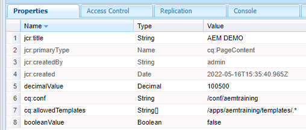
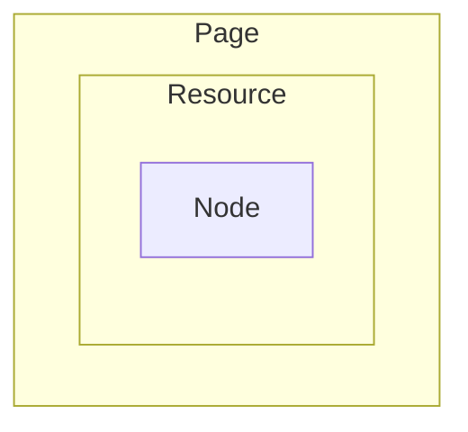

## Data manipulations in AEM Components

### How Components are, is defined by the data architecture

We have many times mentioned that AEM components closely interact with Java Content Repository (JCR). So do AEM services. They read JCR nodes: either one by one, or as node trees. Besides, they create, modify and delete nodes.

JCR is our database. Imagine how many database operations an "ordinary" client-server application invokes. Billions of them. An AEM project does as many operations with JCR.

Surely, the developers of the AEM framework have been aiming to provide a convenient API for these operations.
There’s not a "true" object-relational mapping library in AEM. No likes of Liquibase or Hibernate. Our content repository and content access API are different however playing the same role.

To understand this API, let us review how the content repository is organized.
<details>
<summary><b>Content repository: an overview (expand to see)</b></summary>

The content repository can be presented within three tiers.

The lowest is the **JCR tier**. Basic entities here are _Node_ and _Property_. They belong to the `javax.jcr` package (you see, it’s not even AEM or Sling – this is a part of Java extended core).

You probably already know it but it won’t hurt to repeat: any "unit" of data storage or, in other words, every "record" in JCR is a Node. 

A _Node_ consists of _Properties_ and nothing else. Even if we decided to upload some 2-gigabyte file in JCR, it would end up being just a node. All the bytes of the file will be stored in a property (named `jcr:data`); the encoding being yet another property; and the date of last modification being the third.

Every property has a _type_. There are just 12 property types. You can peek at them [here](https://developer.adobe.com/experience-manager/reference-materials/spec/jsr170/javadocs/jcr-2.0/javax/jcr/PropertyType.html). 

The type for integer numbers is `long`. It means that whatever non-floating point number you put in JCR it casts to `long`. <small>Rather, there's also the `Decimal` time for extra large numbers, but it is rare to appear.</small> The only floating-point type is `double`. There are `boolean`-s, `String`-s and dates. Large data chunks, such as file contents, are stored in `binary` type. The rest of formats are kind of "infrastructural" and are rarely used by developers.

> 
> <br>_Different JCR properties and their types as seen in CRX/DE_

Of all the node’s properties, the main one is `jcr:primaryType`. It defines "species" of the node. Broadly speaking, it says about properties of what types are allowed here, and subnodes of what types can be created.

The JCR tier is comprehensive. Technically, we would need nothing more. But they say the API is not quite convenient, and there’s a lot of boilerplate operations. That is why Sling came up with its Sling Resource notion, and thus installed the second level of abstraction – the **Resource tier**.

_Resource_ is a decorator over a JCR node with convenient accessors. It contains a _ValueMap_ allowing to read and sometimes write a property of a JCR node as easily as we read an entry of a Java map.

Above all, _Resource_ does not only "speak for" a real-world node – it is a high-level abstraction. You can create an on-the-fly _Resource_ in memory without need to store it anywhere. You can declare a descendant class from _Resource_ with new functionality; can serialize and deserialize a _Resource_. It is right to say that the Resource is designed to be a universal data unit, a "global currency" of the AEM world.

Speaking of resources, there are some particular species that are required quite often. 

For example, when a user sends a request to AEM with a path like _/content/home.html_, they effectively request for a resource identified by this path. This is not "any" resource; this is exactly a _page resource_. The notion of Page was not present in Sling. It was added by AEM itself. 

Similarly, when a server checks access rights for a user, it looks for the user data in JCR and finds some resource, again. That would be a _user resource_. Also there are _workflow resources_, _job resources_, _query resources_ etc. They all manifest the third level – **Functional tier**. On this level there are resources and utility classes tailored for some particular (and relatively narrow) business tasks.
</details>

### Adaptation, again
When we speak of a Node, a Resource, or Page, they may sound as similar entities. Actually they belong to three different data tiers: 
* the JCR tier;
* the Sling Resource tier;
* and the AEM's own functional tier.

Tiers are "included" in each other like a Russian doll. That is, whenever we see a programming entity like Page, we understand that the Page is also a Resource, and the Resource is also a Node. Therefore, we can switch from one abstraction to another when we need it.



In pure Java world we would do this like `AbstractFoo abstractFoo = (AbstractFoo) foo` (Widening type cast). Or just vice versa: `Foo foo = (Foo) abstractFoo` (Narrowing type cast. Beware: deemed a bad practice, and is exception prone!). One great limitation here is that `Foo` must be an extension, or else an implementation of `AbstractFoo`.

Apache Sling makes use of the _adapter pattern_ to bypass this limitation. Many and more entities can be "cast" to each other via calls of the `adaptTo(Class<?> targetClass)` method. They can but must not belong to the same inheritance tree, and there are no "narrowing/widening" relations. All are considered "equal in rights". You can write a custom adaptation or an adapter of your own. If an adapter can’t be found, there is not an exception but just a `null`.

<details>
<summary><b>Standard adaptations (click to expand)</b></summary>

Right out of the box you can adapt a _Resource_ to a _Node_, or to a _ValueMap_, or to a _Page_, or else to an _InputStream_ to read the binary file data from the resource. Also you can adapt a _Page_ to a _Resource_ or a _Node_. You are able to retrieve a user session object from a _PageManager_ via adaptation; get a _QueryBuilder_, and so much more.

Besides, you are usually able to adapt a _Resource_ or a _SlingHttpServletRequest_ to a custom Sling model, That’s what `@Model(adaptables = …`) is for!

Here is just a [generic whitepaper](https://experienceleague.adobe.com/docs/experience-manager-64/developing/platform/sling-adapters.html?lang=en) listing some of the vectors of adaptation that are supported in an AEM project out of the box. We will use some of them in our demonstrations later on.
</details>

### Retrieving a resource by its path

In JCR, every piece of data is a _Node_. This is the basement floor. If we look at JCR from one floor above – from the _Resource_ tier – every piece of data is a _Resource_. This is exactly how we look at it most of the time.

One resource is distinguished from another by its position in the JCR tree. The position is defined be the _path_. Most often we retrieve a resource by its path. For this we use the dedicated tool named _ResourceResolver_.

_ResourceResolver_ is quite a complex thing. Enough to say it is user-aware. Same as in a file system of a computer, a user can have access rights to some resources and can be banned from accessing some other. The resources that are not available for the current user, a _ResourceResolver_ will just not retrieve.

Because of this (and due to some extra reasons) we rarely create a _ResourceResolver_ anew. Instead, we use one that is bundled with a _SlingHttpServletRequest_, or else with a _Resource_ that we already have: `ResourceResolver resolver = request.getResourceResolver()`. We can also retrieve a _ResourceResolver_ via injection in a Sling model:

```java
@Model(adaptables = SlingHttpServletRequest.class)
public class MyModel {

    @SlingObject
    private ResourceResolver resourceResolver;

    @PostConstruct
    private void init() {
        Resource newsResource = resourceResolver.getResource("/content/news/article1");
        // ...
    }
}
```

Most commonly used methods of ResourceResolver are `getResource()` and `resolve()`. Both can accept the absolute path of a resource and produce the same result. There are however some differences. 

The `getResource()` method has a rendition that accepts a base resource and a relative path from it. If there isn’t a resource at given path, it returns `null`. 

The `resolve()` method has a variant that accepts a request as an argument. This method can alter the provided path under the hood following some path mappings (such can be set up in an AEM instance to provide a similarity of "url rewriting" rules -such as those  sysadmins sometimes use in an HTTP server). If no resource is found at the given path, a non-null value is returned – an instance of `NonExistingResourse`.

```java
@Model(adaptables = SlingHttpServletRequest.class)
public class MyModel {
    
    @Self
    private SlingHttpServletRequest request;

    @SlingObject
    private Resource currentResource;

    @SlingObject
    private ResourceResolver resourceResolver;
    
    @PostConstruct
    private void init() {
        // .getResource() can return null if the resource is missing
        Resource nonExisting1 = resourceResolver.getResource("/non/existing");
        assert nonExisting1 == null;
        
        // .resolve() method always returns a non-null value
        Resource nonExisting2 = resourceResolver.resolve("/non/existing");
        assert nonExisting2 != null;
        
        // both .getResource() and .resolve() can accept a "base" entity (a resource
        // and a request respectively) and navigate a relative path
        Resource existingChild1 = resourceResolver.getResource(currentResource, "child");
        Resource existingChild2 = resourceResolver.resolve(request, "child");
        assert existingChild1.getPath().equals(existingChild2.getPath());
    }
}
```

### Modifying resources

There are a great deal more methods a ResourceResolver provides. In particular, it can create a new resource, copy an existing one, or else delete it. You can look for these methods in the [official documentation](https://sling.apache.org/apidocs/sling11/org/apache/sling/api/resource/ResourceResolver.html).

Resource operations that change the state of content repository are _transactional_. After you create, modify or delete a resource, the changes should be _committed_ to the data storage. Look at the following example:

```java
@Model(adaptables = SlingHttpServletRequest.class)
public class MyModel {
    private static final Logger LOG = LoggerFactory.getLogger(MyModel.class);

    @SlingObject
    private ResourceResolver resourceResolver;

    private void createChildResource(
            Resource parent,
            String name,
            Map<String, Object> properties)
            throws LoginException, PersistenceException {

        String newResourcePath = parent.getPath() + "/" + name;
        Resource possibleExistingResource = resourceResolver.getResource(checkPath);
        if (possibleExistingResource != null) {
            LOG.info("Resource {} already exists", newResourcePath);
            return;
        }
        Resource newResource = resolver.create(parent, name, properties);
        resolver.commit();
        LOG.info("Resource created at {}", newResourcePath);
    }

    // Elsewhere in the code... 
    private void doStuff() {
        Resource parentResource = getParentResourceFromElsewhere();
        String newResourceName = "child1";
        Map<String, Object> newResourceProperties = Map.of(
                "jcr:title", "Hello world",
                "jcr:description", "My first resource");

        createChildResource(
                parentResource,
                newResourceName,
                newResourceProperties);
    }
}
```
What happens here? We’ve got some resource, referenced by the variable `parentResource`, and wish to create a child for it. We call the `createResource()` method and pass into it the parent resource, the name of the newly created resource, and the map of properties the new resource will have from the start.

Within the createResource() method, first we check whether the resource at the given path already exists. If this is so, the routine cannot proceed. Otherwise we call the `resolver.create()` method passing the parent resource, the name of the child, and the initial properties. 

Even as the method is completed without an exception, we still need to commit changes. It’s only then that the resource is actually stored in the JCR.

Commit is also used when you modify a resource. Remember that modifying just means putting values in the resource’s value map. For that sake the resource is adapted to a particular value map variant – the `ModifiableValueMap`:
```
Resource resource = getResourceFromElsewhere();
ModifiableValueMap valueMap = resource.adaptTo(ModifiableValueMap.class);
valueMap.put("jcr:title", "New title");
resource.getResourceResolver.commit();
```

Now you wonder what types of values can be put in such a map? No surprise, these are data types supported by JCR. You can use all primitives and their boxed variants (they will all be coerced to `long`, `double`, and `boolean`), a `String`, and a `Calendar` or `Date` for the date value.

Remember we said that you can retrieve a resource resolver from an existing resource? We use this option here to get one and execute the commit method right away.
```
resource.getResourceResolver.commit();
```

### PageManager object

What is peculiar about ResourceResolver is that it can be adapted to a _PageManager_ and to a _Session_.

The _PageManager_ is related to the 3rd tier of data structure in AEM. While the _ResourceResolver_ is a part of Apache Sling, the _PageManager_ is an asset of exactly AEM. It is used to handle that very species of _Resource_ which is also AEM-specific – the _Page_.

Where the ResourceResolver does `getResource()`, the PageManager does `getPage()`. It also has methods for creating a new page, copying, moving and deleting an existing page, and more.

Besides, the PageManager supports a bunch of methods that manage page versions – in AEM a page can be preserved in several renditions with the ability to go back and forth in the history of changes (you might have used the same feature editing e.g. Google Docs).

Changes to pages are also committable. Although the _PageManager_ does not have the `commit()` method of its own, you can use a ResourceResolver object, or a Session to save the changes. Surely, you can as well adapt a _PageManager_ instance back to _ResourceResolver_ if you need to:
```
ResourceResolver resolver = myPageManager.adaptTo(ResourceResolver.class);
if (resolver != null) {
    resolver.commit();
}
```
More info oin PageManager is [here](https://developer.adobe.com/experience-manager/reference-materials/6-5/javadoc/index.html?com/day/cq/wcm/api/PageManager.html).

### Session object

Session is the object that encapsulates the logic related to the rights and capabilities of the current user in regards to the content repository.

There is always a user with their defined rights – even if no one entered a login and password. Usually the non-logged user – the anonymous – enjoys only minimal rights, but this can be modified by the server admin. Also, the majority of AEM’s system services act on behalf of some particular user. Session has to deal with all this stuff.

Session has its own methods for committing changes to the content repository or else discarding them – respectively, `save()` and `refresh(false)`. 

They often call `session.refresh()` within a loop of multiple writes to JCR (e.g. when we update dozens of resources in a batch). AEM is known for getting floating errors that might arise inside a massive writing routine and mess up the process. Refreshing the session helps to fight them.

More info on Session can be found [here](https://developer.adobe.com/experience-manager/reference-materials/spec/jsr170/javadocs/jcr-2.0/javax/jcr/Session.html).

### ModelFactory. How to "cross-breed" a request and a resource?

Now that you know a lot about manipulating resources, we will visit a question that may look like an advanced one. It however arises quite often in a real-world project.

There are occasions when you cannot rely on the provided Sling instantiation/injection mechanism and need to craft a Sling model in your own code.

Such could happen, e.g., when you possess a `@Model(adaptables = Resource.class)` but this time want to adapt it from a `SlingHttpServletRequest`, or just vice versa. You consent that not all the fields will be properly injected. But you actually need just a couple of them, and you are OK with the rest remaining `null`s.

Another common case is when you’ve got at hand a _SlingHttpServletRequest_ which encapsulates a resource. You wish that the effective model used the current request but accounted for some foreign resource (and not the one from the current request) when injecting values.

For such cases, there is the ModelFactory service that we can inject in our Sling model.
Look at the following resource structure:
```
/
 └ content
   └ first [jcr:title = "First"]
     └ second [jcr:title = "Second"]
```

…and consider a request to the path _/content/first_. Let us think that the response is rendered by a component that is backed by the following Sling model:
```java
@Model(adaptables = SlingHttpServletRequest.class)
public class MyFirstModel {
    // Handles the resource at path /content/first

    @SlingObject
    private SlingHttpServletRequest request;

    @SlingObject
    private Resource currentResource;

    @OSGiService
    private ModelFactory modelFactory;

    private MySecondModel secondModel;

    @PostConstruct
    private void init() {
        Resource secondResource = currentResource.getChild("second");
        secondModel = modelFactory.getModelFromWrappedRequest(
                request,
                secondResource,
                MySecondModel.class);

        assert "Second".equals(secondModel.getTitle());
        assert "/content/first".equals(secondModel.getRequestPath());
    }
}

```

As you see, this code refers to another class by the name `MySecondModel`, here it is:
```java
@Model(adaptables = SlingHttpServletRequest.class)
public class MySecondModel {

	@Self
	private SlingHttpServletRequest request;

	@ValueMapValue(name = "jcr:title")
	private String title;

	public String getRequestPath() {
		return request.getPathInfo();
	}

	public String getTitle() {
		return title;
	}
}
```

Let us review the two code snippets. As the instance of `MyFirstModel` is created, values get injected, and the `init()` method is called by the Sling engine. `currentResource` has the path _content/first_ as it matches the path that was originally requested.

Within the `init()` we retrieve a child resource of the current one, by name `secondResource`, and then convert it to a `MySecondModel` object.

If we tried to do this like `secondResource.adaptTo(MySecondModel.class)`, we would fail because `MySecondModel` is request-adapted and we have just the resource. Fortunately, we have the reference to the existing request, and can "cross-breed" it with the reference to `secondResouce` with help of `modelFactory`.

Eventually we receive an instance of `MySecondModel` which exposes a value map property of `the resource at path _/content/first/second_ while reporting the path of the original request - _/content/first_.

> Want a more real-world example? See how we create a list of secondary Sling models ("Tracks") from children of a root resource rendered by the "Album" component [in our sample project](/project/core/src/main/java/com/exadel/aem/core/models/Album.java).  

By using such techniques as those described above, we can leverage versatile backend logic for out AEM components.

---

[To previous part](part1.md)

[To Contents](../../README.md)
