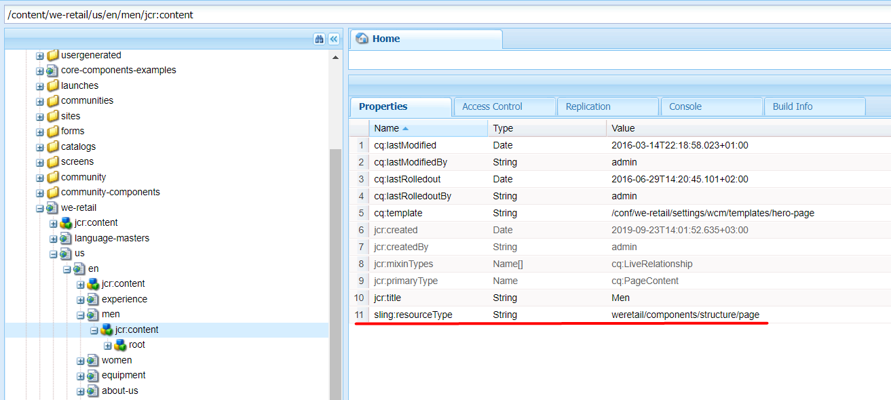
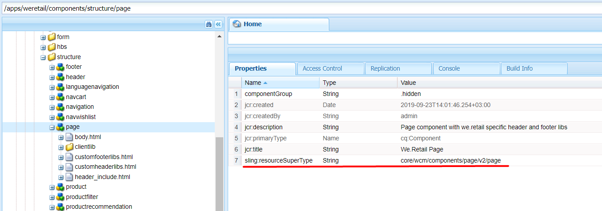
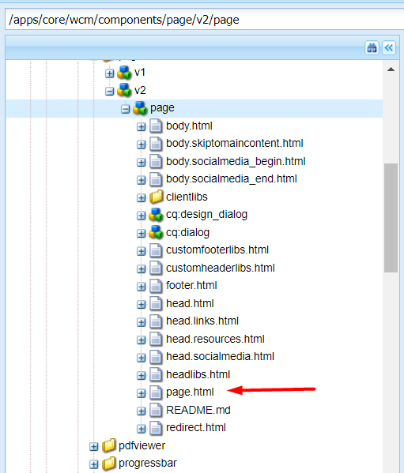
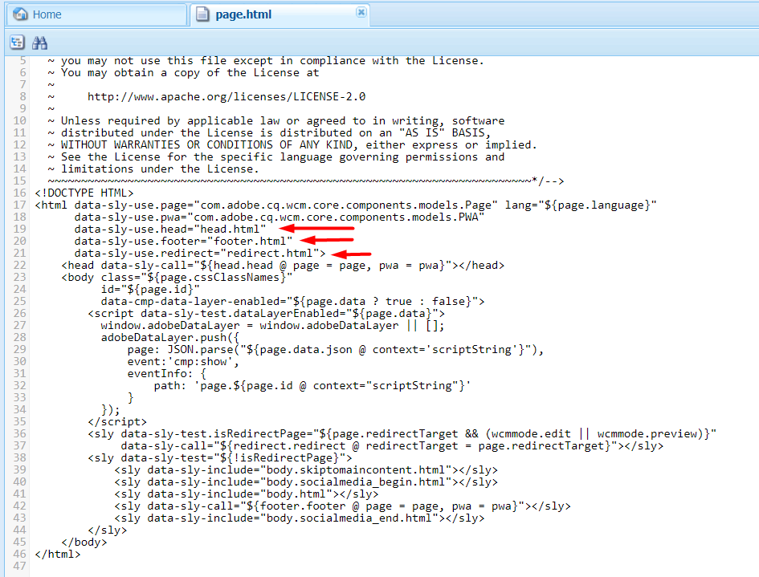

# 2.9 Rendering Page with Components

As we remember from the previous lessons, In AEM, everything is stored as structured content in a JCR.  JCR content information is stored in the form of nodes containing values as attributes.  Sling refers to these nodes as a Resource. In pages/components used Resources and their values to render the UI on the web pages.
As Sling is a web framework it renders data via HTTP requests. In Sling, as we start to process a URL, first we must find out what content object it corresponds to. Second, the engine picks up the rendering script that matches this particular object. And, third, the script finally renders the content as an HTML document, XML, JSON, etc. This provides excellent support for web content authors to build pages, which are easily customized to their requirements.

Since Sling is the request-processing engine of AEM, the web addresses that AEM uses are often called "Sling URLs'. These URLs are peculiar.  An experienced developer can often tell whether a website runs AEM or not, from just looking at the URL.
Also, Sling URLs are quite complex.
Let us "decompose" a Sling URL, that is,  extract from it some components.

Imagine you are the Sling engine. You've been given an address like http://www.example.com/products/product1.one.two.html/a/b?a=b
How do you treat this?
1. First, the ordinary-looking parts: the schema (protocol), the host name, and the port.
2. Then comes the path. Path most often maps to a node in JCR (== to a Resource in Sling). But not always. There could be a Servlet that declared this path however it is not a resource. For existing resources the resource path is the longest match (also considering its mappings) pointing to a resource where the next character is either a dot (.) or it is the full request URI. Otherwise (for a path not matching any existing resource) the resource path ends at the first dot (.) in the request url. The exact logic for retrieving the resource path is implemented at ResourceResolver.resolve(HttpServletRequest, String) called from org.apache.sling.engine.impl.request.RequestData.initResource() with the 2nd argument being the request path. It is impossible to tell by just looking at the request URI where the resource path part ends. You have to know the underlying resource structure to know how a URL is decomposed. You cannot safely assume that the resource path will always end at the first dot!.
3. Selectors - If the first character in the request URL after the resource path is a dot (.), the string after the dot up to but not including the last dot before the next slash character or the end of the request URL comprises the selectors. If the resource path spans the complete request URL no selectors exist. If only one dot follows the resource path before the end of the request URL or the next slash, also no selectors exist.
4. extension - The string after the last dot after the resource path in the request URL but before the end of the request URL or the next slash after the resource path in the request URL is the extension.
5. suffix - If the request URL contains a slash character after the resource path and optional selectors and extension, the path starting with the slash up to the end of the request URL is the suffix path. Otherwise, the suffix path is empty. Note, that after the resource path at least a dot must be in the URL to let Sling detect the suffix.
6. fragment.

http://www.example.com/products/product1.one.two.html/a/b?a=b
| protocol | host | resource path | selectors | extension | suffix | params |
| --- | --- | --- | --- | --- | --- | --- |
| http:// | www.example.com | products/product1 | one.two | html | a/b | a=b |

To better understand the process of rendering a page with components, let's break down the rendering of the page http://localhost:4502/content/we-retail/us/en/men.html.
Sling takes a unique approach to handle requests in that a request URL is first resolved to a resource, then based on the resource it selects the actual servlet or script to handle the request.
Resources — the central part of Sling, which represents the resource addressed by any request URL. It is the resource that is first resolved when handling a request. Based on the resource, a first servlet or script is then accessed actually to handle the request.
For our URL http://localhost:4502/content/we-retail/us/en/men.html, the longest matching URL before the first "." will be our resource path. In our case it should be /content/we-retail/us/en/men We will now hit this resource in the repository

As you can see this resolves to a cq:Page. So the next thing SLING will look for is a content node (jcr:content). If that is not found, an error will be thrown. A page is only valid a valid resource if has the below structure:
+page
-jcr:primaryType:cq:Page
+jcr:content
-jcr:primaryType:cq:PageContent
Now let's go to the jcr:content node. So, SLING will look for a property called sling:resourceType. This is the property that defines what (or better say where) is the resource for this node. So for the page /content/we-retail/us/en/men  the sling:resourceType is wknd/components/structure/page

SLING will look for the resources first under /apps and then under /libs

For the resource /apps/wknd/components/structure/page  Sling will look for the best match as below if we don’t have any selectors in our request:
1. page.html
2. html.html
3. If none of the files mentioned above is present in your component, and it has a sling:resourceSuperType, then SLING will go and take a look at that component in a similar manner to find if any script can be resolved to render content.
4. GET.html

In our example the best match is sling:resourceSuperType. So we go to /apps/core/wcm/components/page/v2/page.

In /apps/core/wcm/components/page/v2/page the best match for us is page.html.

We see that our script page.html uses different scripts, to render included scripts Sling first goes to the CHILD component (/apps/wknd/components/structure/page - in our case), checks if the file is there and then looks at PARENT component (/apps/core/wcm/components/page/v2/page - in our case). 
F.e. head.html and footer.html we have under /apps/wknd/components/structure/page (CHILD) and /apps/core/wcm/components/page/v2/page (PARENT), Sling uses files under /apps/wknd/components/structure/page (CHILD) to render the page.
As you know page is just one type of component that involved other components, rendering the rest components under the http://localhost:4502/content/we-retail/us/en/men.html has the same approach that we discussed above.

## 2.9.1 Matching between resource address in AEM and JCR nodes. Rendering resources from JCR like HTML, JSON, TXT and etc.

AEM content can easily be rendered via Sling Default GET Servlet to render JSON, HTML, XML, and TXT.
A default servlet is selected if no servlet or script for the current resource type can be found.
To render node by required render just need to provide a correct view (extension) (if it is not forbidden by the dispatcher, user permissions, etc). As you need to render the HTML view, use the .html extension with your node to get rendered HTML. So your node path will be /content/path/to/node/jcr:content/node.html
AEM, via Sling, also supports developing and deploying custom sling renderers to take full control of the rendered schema and content.
Under /system/console/servletresolver can check which servlet is responsible for rendering path.

## 2.9.2 Default Sling POST Servlet. Store data in JCR by address.

Sling default POST Servlet also called the SlingPostServlet is one of the options to modify content in Sling. It is a default handler for all POST requests that gives you endless options for creating, modifying, deleting, copying and moving nodes in the repository.

The SlingPostServlet is actually just a gateway to the actual operations. To select the actual operation to execute, the :operation request parameter is used. Out of the box, the SlingPostServlet supports the following operations:
- operation not specified - Create new content or modify existing content
- delete - Remove existing content
- move - Move existing content to a new location
- copy - Copy existing content to a new location
- import - Import content structures from JSON/XML/Zip
- nop - Explicitly requests to do nothing and just sets the response status
- checkin - Check in a versionable node
- checkout - Check out a versionable node
All these operations are always performed on the resource to which the request was issued as returned by SlingHttpServletRequest.getResource(). Some operations require additional parameters to be set to operate completely.
Please note that operations are mutually exclusive. For a single POST request only one operation may be executed. Operations also only consume the request parameters as described below. Any excess parameters are silently ignored.
The following diagram shows examples of using request parameters we described above and you can use them when dealing with the SlingPostServlet. (will be changed to code in project)

## 2.9.3 The most important attributes JCR nodes / Sling resources: jcr:primaryType, sling:resourceType, sling:resourceSuperType. Their values.

Jcr:primaryType is a special property. All nodes have jcr:primaryType property. Depending on the jcr:primaryType of the current node, you will be or will not be able to add specific properties to the current node, or create child notes of specific types. E.g., you cannot create a node of type cq:Page under the parent node of type nt:unstructured. You cannot create nu:unstructured under nt:folder. However you are able to create nt:unstructured under sling:Folder, and so on. This property is protected, it cannot be removed or changed by the application using the API.

sling:resourceType property sets in jcr:content and contains a path, which is used by the Servlet and Script resolver to find the appropriate Servlet or Componentto handle the request for the Resource. Path used can be absolute or relative. This mechanism offers more freedom than one in which the script accesses the data entities (as an SQL statement in a PHP script would do) because a resource can have several renditions. If multiple scripts apply for a given request, the script with the best match is selected.
sling:resourceSuperType: It is used to achieve inheritance. When set, it inherits the specified component to this component, allowing us to override some of the scripts.

