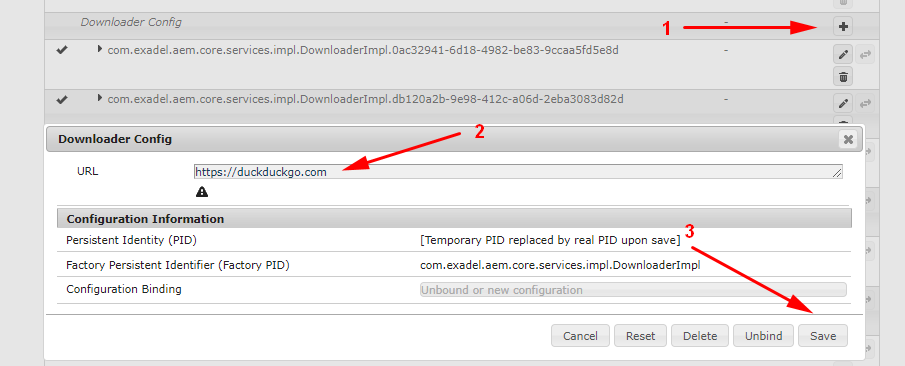

## 11. OSGi services: configuring and use-cases

### Services can be controlled with OSGi configurations

We have learned that OSGi services support properties that one can specify in development time. Apart from these, OSGi services support user config. 

The config is dynamic in nature. A developer can provide default values that will be populated to all AEM instances. Then a DevOps guy or an admin will be able to set alternative values for a particular instance as needed. These new values will be in effect with no need to restart anything - neither the server itself nor a single bundle. 

### Creating object config definitions

To add the support for a user config to a service, you need to make it consume a config object. Usually, the config is defined in the body of an annotation (it may look a bit weird, but merely an annotation is convenient for declaring default values).

Here is a sample config object:

```java
@ObjectClassDefinition(name = "MyService Config")
public @interface MyServiceConfig {

    @AttributeDefinition(name = "Link URL")
    String linkUrl() default "https://google.com";

    @AttributeDefinition(name = "Connection Timeout (ms)")
    int timeout() default 30_000;
    
    // ...
}
```

Such an object can be placed separately in the code base. Else, it can be a nested class of a service. 

The object must be annotated with the `@ObjectClassDefinition` meta-annotation. The annotation has several optional fields that mostly affect the presentation of the config in the Felix console at `https://<aem_host>:<aem_port>/console/bindles/configMgr`;

Fields of the config object must be annotated with `@AttrbibuteDefinition` and usually provide default values. Accepted value types are the same as value types available for storing data in JCR. <small>However, the `@AttributeDefinition` annotation has some properties that enrich the user experience. E.g., you can provide a set of `options` that would make it look like a select dropdown.</small>

> You can look at a more real-world looking sample in the reference project code [here](/project/core/src/main/java/com/exadel/aem/core/services/impl/TrendyBeatzDownloader.java) (look for the `Config` declaration at the bottom).

Whether the config object is created within a service or separately, it must be referenced with the `@Designate` on the service itself:
```java
@Component
@Designate(ocd = MyServiceConfig.class)
public class MyServiceImpl implements MyService {
    // ...
}
```
### Modifying config manually

As the service bound to an object config definition gets to an AEM server, the config becomes available in the `https://<aem_host>:<aem_port>/console/bindles/configMgr`.
Below is the image of config created out of sample project's `TrendyBeatzDownloader` service:


As you make a change and press "Save", the new config is applied to the service. If it has a `@Modified`-annotated method, the method is fired. Otherwise, `@Activate`-annotated method is fired. <small>Knowing this, one day, you may want to open the config and click "Save" without making any changes. Thus you effectively "restart" the service - or rather trigger some cleanup/restarting logic that could be conceived in the `@Activate`-annotated method.</small> 

### Setting config with the project code

Often a service must work differently depending on the AEM instance. E.g., if it applies to a 3rd-party service, there must be the need to request one endpoint for testing purposes and another in the production environment. A service can behave one way in an author instance and another way when in a publisher. The data a service reads may depend on the _runmode_ (or "execution profile"), and so on.

That is why AEM provisions an elaborate system of context-specific configurations.

This config can be specified in two ways:
- with JCR nodes (= XML files in code) of the type `sling:OsgiConfig`;
- with configuration files (nowadays usually in JSON format).

In the sample project, [you will find both](/project/ui.config/src/main/content/jcr_root/apps/sample-project/osgiconfig).

Either config files or config nodes are distributed between folders. Each folder's name starts with `config`. 

There is always a folder that is named just `config`. It contains the "fallback", or else "generic", config values applied to OSGi services in every instance unless a more specific config is not found.

The rest of the folders represent more specific configs. Their names follow the pattern `config.<runmode1>.<runmode2>...`. E.g., 
* `config.author` will contain configurations that are applied on author instances (does not matter if it is a local author instance, a testing author, or a production author instance). 
* `config.prod` will contain configurations that apply in production environments, either author or publish. 
* `config.testing.author` is applied only in the authoring instance and only in the testing environment. 

<small>Note that the words like _"author"_, _"testing"_, _"prod"_, etc. are just the names or runmodes. These are rather arbitrary names that change from project to project. Yet, usually, they are "talking" names that explain the role of the environment.</small> 

Every `config.*` folder contains nodes (or files). The name of the node/file matches the fully qualified name of the configurable service. This is not necessarily a custom service. You may configure an out-of-the-box service as well if you know what properties are manageable. 

> In the sample project, we provide configuration for the custom service `TrendyBeatzDownloader` in the form of XML node ([see](/project/ui.config/src/main/content/jcr_root/apps/sample-project/osgiconfig/config/com.exadel.aem.core.services.impl.TrendyBeatzDownloader.xml)).
> 
> Plus the configuration for the standard `LogManager` service as a JSON file ([see](/project/ui.config/src/main/content/jcr_root/apps/sample-project/osgiconfig/config/org.apache.sling.commons.log.LogManager.factory.config~sample-project.cfg.json)).

### Factory configurations

OSGi configurations are often used to make it possible that several instances of a service are created, and every instance is controlled by some particular config values. 

Think, for example, of a service that requests a 3rd-party HTTP server and downloads some data. Imagine that we deal with three different HTTP servers simultaneously. A sensible solution is to have three instances of the downloader service, each supplemented with its own endpoint configuration.
```java
@Component
@Designate(ocd = DownloaderImpl.Config.class, factory = true)
public class DownloaderImpl implements DownloaderService {
    
    private String url;
    
    @Override
    public void download() {
        downloadInternal(this.url);
    }
    
    @Activate
    @Modified
    private void doActivate(Config config) {
        this.url = config.url();
    }
    
    // ...

    @ObjectClassDefinition(name = "Downloader Config")
    public @interface Config {

        @AttributeDefinition(name = "URL")
        String url() default "https://google.com";
    }
}
```

The only important difference with the samples above is the `factory = true` property of `@Designate`.

Deploying such a service will produce a noticeable effect on the Felix ConfigMgr console, though.



There is now the "plus" button that allows adding another configuration (= another service instance dealing with yet another _url_). You can dump redundant service instances with the "trash" button.

Factory configurations can be set up via the code as well. Look again at the [LogManager's config](/project/ui.config/src/main/content/jcr_root/apps/sample-project/osgiconfig/config/org.apache.sling.commons.log.LogManager.factory.config~sample-project.cfg.json) in our sample project. 

The name of the file contains the `factory.config~<something>` part. You can create multiple such files, differing by the word in place of `<something>`. Any meaningful word would go, just make them unique. Each file would manifest a single _LogManager_ instance. All the files together would build up to the factory config of the _LogManager_ service.

There's actually more to know about services configurations. Please learn [this Adobe's document](https://experienceleague.adobe.com/docs/experience-manager-65/deploying/configuring/configuring-osgi.html#osgi-configuration-with-configuration-files) for greater detail.

---

[Continue reading](part2.md)

[To Contents](../../../README.md)

