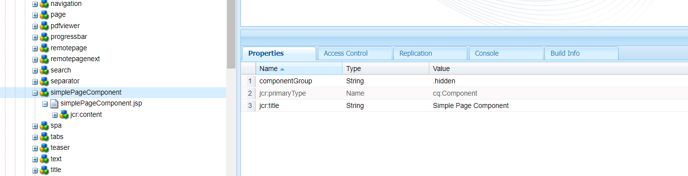
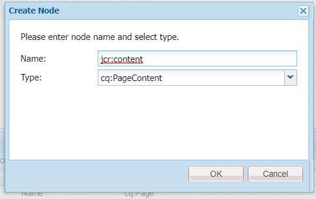
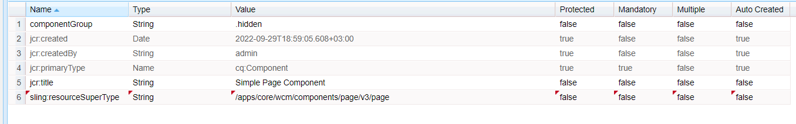
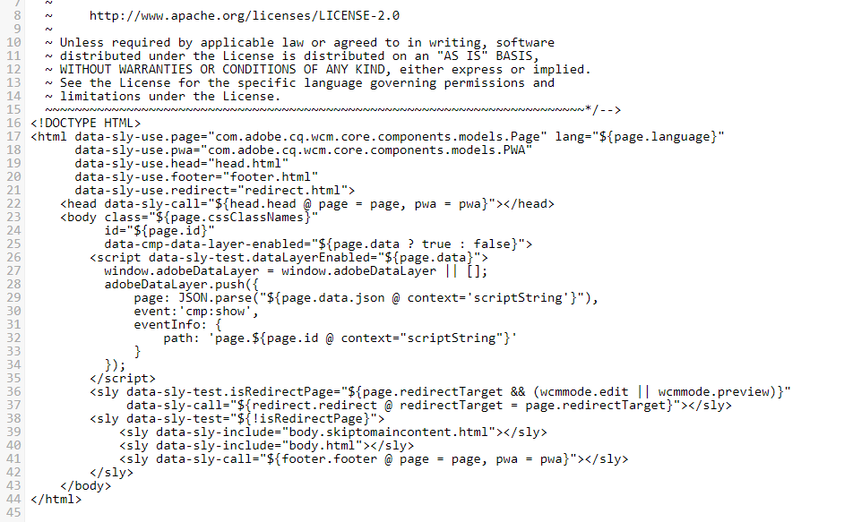
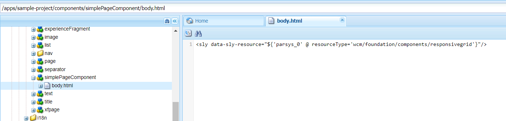
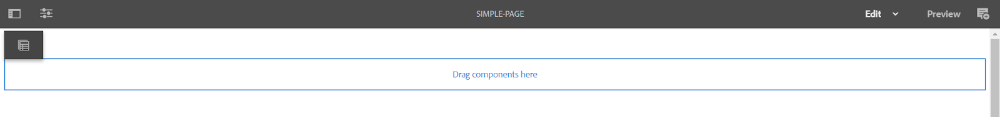
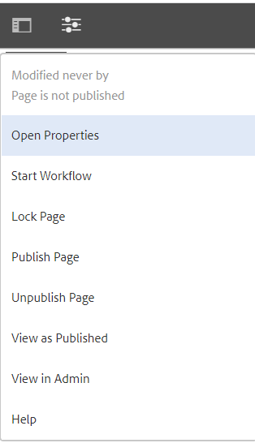
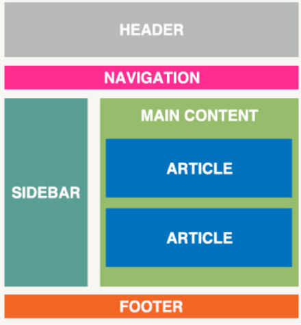
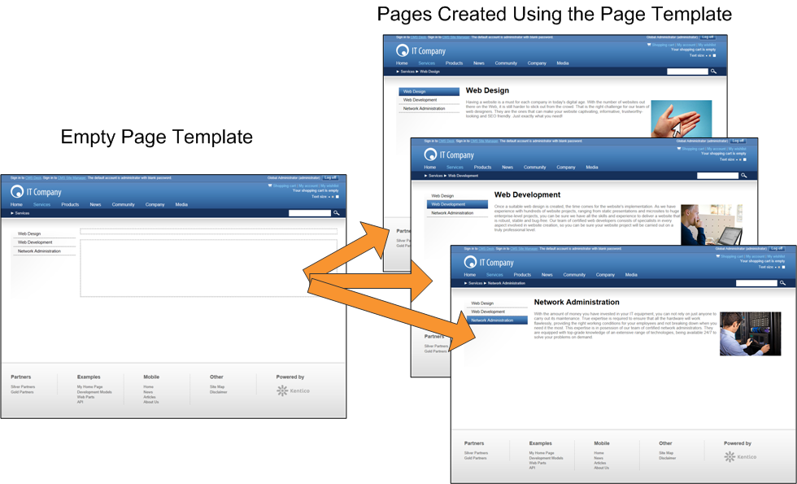

## 8. Templates In AEM

So far you have learned how to create components and authoring interfaces for them. But components are just building blocks that are used for creating full-featured pages. In this lesson, we will learn how pages are built in AEM.

### Page Component

No page can function without a page component. A page component is mostly similar to any other component: it consists of one or more script files, it can have an authoring dialog, and it can include other components and function as a container. Usually, the page component defines `<head>` and `<body>` tags, includes `<meta>` tags, style and script files.

Let’s create a simple page component and a page that uses it. For demonstration purposes, we will do everything in CRXDE, but keep in mind that page creation is usually done in an IDE and the resulting files are then deployed to environments via a package.

Note: We are using the sample project as the base and assume that you have it already installed on your AEM instance.

#### Creating a page component

1. Go to CRXDE, open _/apps/sample-project/components_. Right-click on the ‘components’ folder, choose “Create” -> “Create Component”
   
   
2. Specify the following component properties:  
   Label: simplePageComponent  
   Title: Simple Page Component  
   Group: .hidden

   
3. Click “Next”, then “OK”, then save the changes.
 
   
4. Rename `simplePageComponent.jsp` into `simplePageComponent.html` and double-click on the file to open it for editing.
5. Replace the existing code with the following markup:

```html
<!DOCTYPE html>
<html>
<body>
<h1>Hello World!</h1>
</body>
</html>
```


Save the changes

Now we will create a page that will be rendered by this page component.

#### Creating a page based on the page component

1. Open _/content/sample-project/us/en_
2. Right-click on the ‘en’ node, choose “Create” -> “Create Node”
3. Specify the following properties:  
   Name: simple-page  
   Type: cq:Page
   
     

   Save the Changes
4. Right-click on the ‘simple-page’ node, choose “Create” -> “Create Node”
5. Specify the following properties:  
   Name: jcr:content  
   Type: cq:PageContent  

     

   Save the changes
6. Add the following properties to the `jcr:content` node  
   sling:resourceType - /apps/sample-project/components/simplePageComponent (the path to the page component we have created).  
   jcr:title - Simple Page  
   As you already know, `sling:resourceType` is one of the most important properties of a node - it links the content with the scripts that can render this content  

   

   Save the changes
7. Open http://localhost:4502/content/sample-project/us/en/simple-page.html and you will be able to see that the page uses the markup of the page component  

   

Real page components are usually more complex. The page markup includes meta tags, JS and CSS scripts, etc. Page components have one or more editable regions where the authors can add new components. Also, page components usually have an authoring dialog that is used for specifying properties of the whole page. We could create all these elements from scratch, but instead of doing that, let’s save us some time and use native AEM capabilities.

AEM offers an override mechanism that allows us to “inherit” one component from another and override only the parts that we need to customize. Let’s extend our page component from an OOTB one to see the advantages of this approach.

#### Extending the page component from an OOTB page component

1. Go to CRXDE, open the page component _/apps/sample-project/components/simplePageComponent_ that we have previously created.
2. Add a new property to the component node  
   sling:resourceSuperType - /apps/core/wcm/components/page/v3/page  

     

   Save the changes.  
   `sling:resourceSuperType` is the analogue of the “extends” keyword in Java - it allows us to extend one component from another. Let’s examine the page component we are planning to extend and decide, which parts we want to override
3. Open _/apps/core/wcm/components/page/v3/page_ and examine the list of files it includes.  

     

   First of all, we have a README.md file which contains the detailed documentation of the component. Secondly, we have a `cq:dialog` node that allows authors to specify page properties. You already know about component dialogs from lessons 2.5 and 2.6, these dialogs are almost identical. Thirdly, we have `page.html` script. Since the node is named ‘page’, `page.html` script is the entry point from which AEM starts rendering the component.
4. Examine `page.html` script  

     

   We see that this script serves the same purpose as our `simplePageComponent.html` - it defines the page “skeleton”.This script includes other scripts - `head.html`, `body.html`, `footer.html`. This gives us more flexibility - we can override what we want to customize while inheriting other parts of the patent page component.  
   For now, we will override only the `body.html` part of the page - we want our page to have one layout container.
5. Return to _/apps/sample-project/components/simplePageComponent_. Delete `simplePageComponent.html` and add `body.html`   
   Paste the following code into `body.html`:

   ```html
   
     <sly data-sly-resource="${'parsys_0' @ resourceType='wcm/foundation/components/responsivegrid'}"/>
   ```

     

   Save the changes.

6. Now let’s open the page we created earlier and see, how these changes are reflected in the page itself. http://localhost:4502/editor.html/content/sample-project/us/en/simple-page.html
  
   

   As we can see, instead of static “Hello world” markup, we now have an editable region of the page, where we will soon be able to add new components. Also, we are now able to define page properties.
7. Click on the equalizer icon and open the page properties dialog  

   

   Here we can see the Page properties dialog, which allows us to define meta information, page permissions and other page metadata.

   

   This page properties dialog is inherited from the parent component, but we could also customize it on simplePageComponent level. Customizing page properties is out of this lesson’s scope, but you can read more about it [here](https://experienceleague.adobe.com/docs/experience-manager-learn/sites/developing/page-properties-technical-video-develop.html?lang=en).

### Templates: an introduction

The page above is still quite simple. Real pages usually have a defined layout and pre-existing components (such as header and footer).



Ideally, we don’t want to duplicate these structural elements on every page, we would like to define them in one place in order to avoid duplication. But how can we do it? The answer is templates. AEM templates are a flexible mechanism for defining the structure, initial content and allowed components for groups of similar pages.



AEM has 2 types of templates - static and editable. Static templates are the original templating system that was built on the assumption that the developers define all templates for a project. Editable templates were developed later with the new paradigm in mind: authors should be able to create and edit templates too. Editable templates also provide more abilities to edit page structure for all pages created on the template (hence the name - “editable” template.

There is almost no difference between these two template variations when you are creating a new page, editing content, publishing the changes. But they are vastly different from the development point of view. We will cover both template types, but let’s start with the older flavour - static templates.

---

[Continue reading](part2.md)

[To Contents](../../../README.md)

